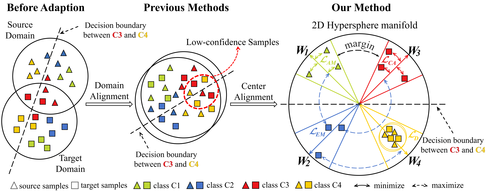
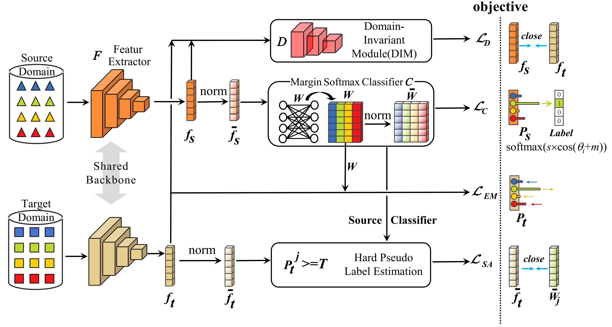

# ACAN
一种即插即用的自适应中心对齐网络，用于无监督域适应

## Abstract
ACAN旨在改善迁移学习中的**域适应**问题

- 它是可拔插的: 容易集成在其他的**域对齐**算法中

- 使用新的损失: 角度间隔损失取代softmax+cross_entropy 使分类器C对特征的判别更强

让不同的类的特征在角度空间分得更远

- 熵正则: 使用熵正则鼓励目标域的样本分布集中 减少分类边界的不确定样本

- 中心对齐: 提升模型在目标域上的判别能力 ACAN通过伪标签 将目标样本对齐到对应的类别中心

## 框架

首先 源域(Source Domain)和目标域(Target Domain)经过**同一个**CNN(Shared BackBone) F 得到**特征** $f_s$和$f_t$

这时$f_s$和$f_t$被拿去经过一个域不变化模块(DIM) 然后输出$L_D$ 也就是在**第一行**

然后$f_S$和$f_t$各自经过一个归一化 

其中 $f_s$归一化后 过一个**带边界**的分类器C 然后得到$L_C$

