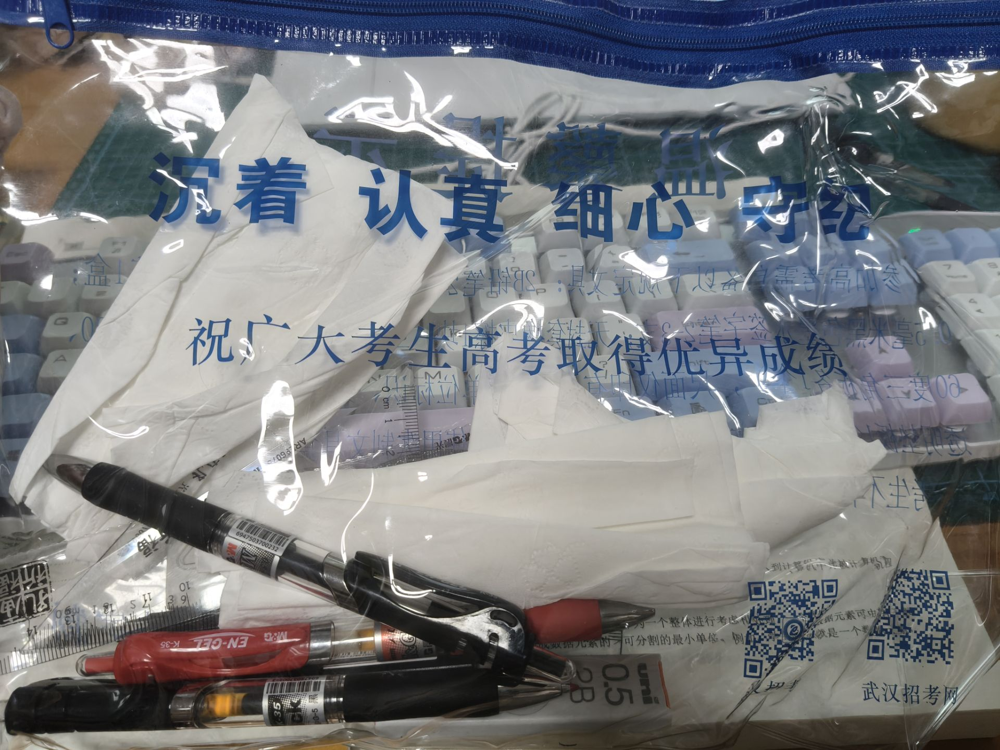

# 2025/8/11
## 心情
我的心里五味杂陈.

我从包里拿出了高考用的袋子 

包里有几支晨光的黑笔 尺子 红笔 三菱的铅笔(这支铅笔用了2年) 还有很多防止感冒的餐巾纸

看到这些东西我的思绪又回到了那三年... 我对这三年的情绪极其的复杂

痛苦又有很多怀念... 我并不怀念同学 我对他们没有任何的感情. 我怀念的是几位老师 以及

这三年的我.

由于这是blog,所以有些内容我并不敢写出来 但我自己能理解是什么心情.

欲远集而无所止兮，聊浮游以逍遥。

及少康之未家兮，留有虞之二姚。

思九州之博大兮，岂惟是其有女？

## 接着呢
我的408的书到了. 我知道我接下来需要做什么.
