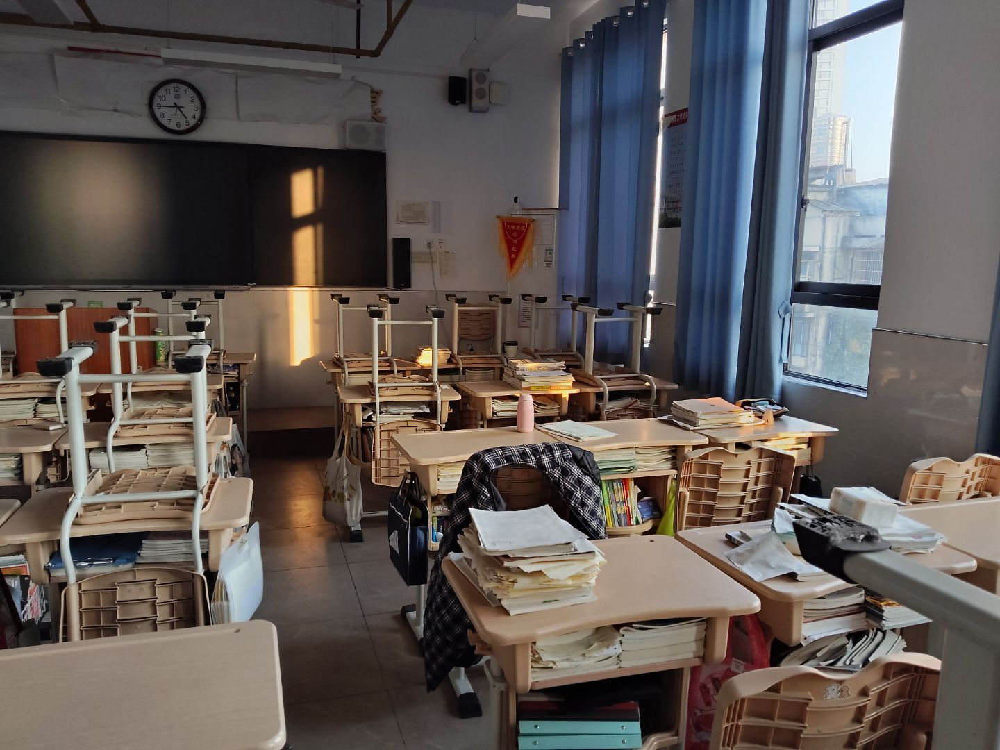

# 2025-8-24
现在是02:27分凌晨 我已经很多天作息昼夜颠倒了.

我看到了某个同学在班级群里发了个我们教室的照片 我感慨万千.

我看到这熟悉的课桌 熟悉的位置 熟悉的阳光 熟悉的教室

熟悉的书

顿时一股酸意涌上心头.

我曾于此生活三年之久

相逢与离合的场景一幕幕留在此地

做过的许多傻事也归档在这的时空中

我并不怀念这里 好吧 我也许怀念

对于这里的情感是复杂的 是病态的

一次次的调考 一次次的上课 一次次的罚站 一次次的与老师的钩心斗角..

我始终无法正视自己的情感

我羞耻于此.

在道德的至高点站立太久后 是下不来的

不仅仅在道德上下不来了 一切一切的事情上 也不容易下来了..
