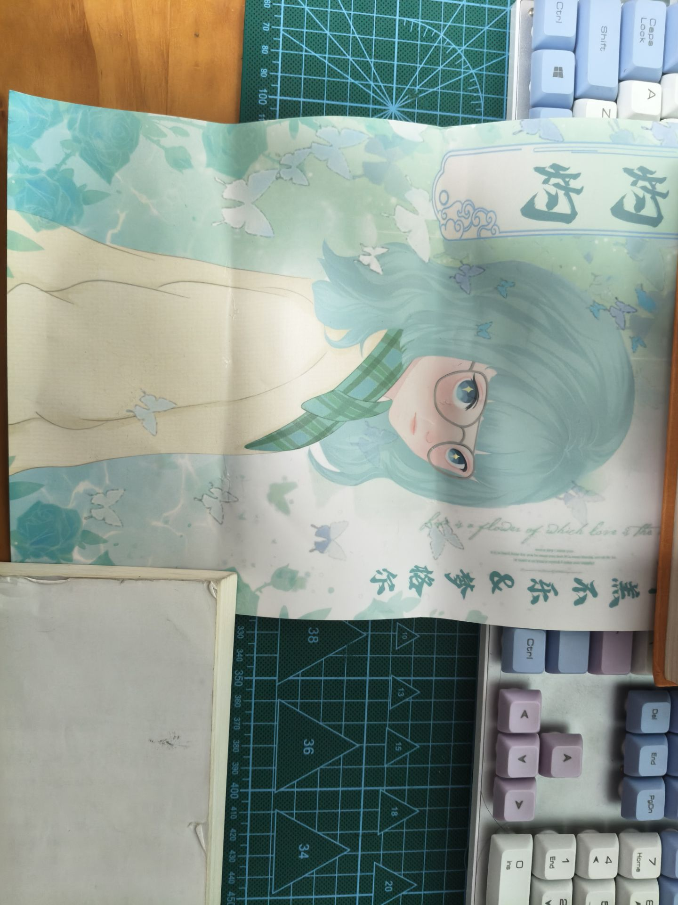
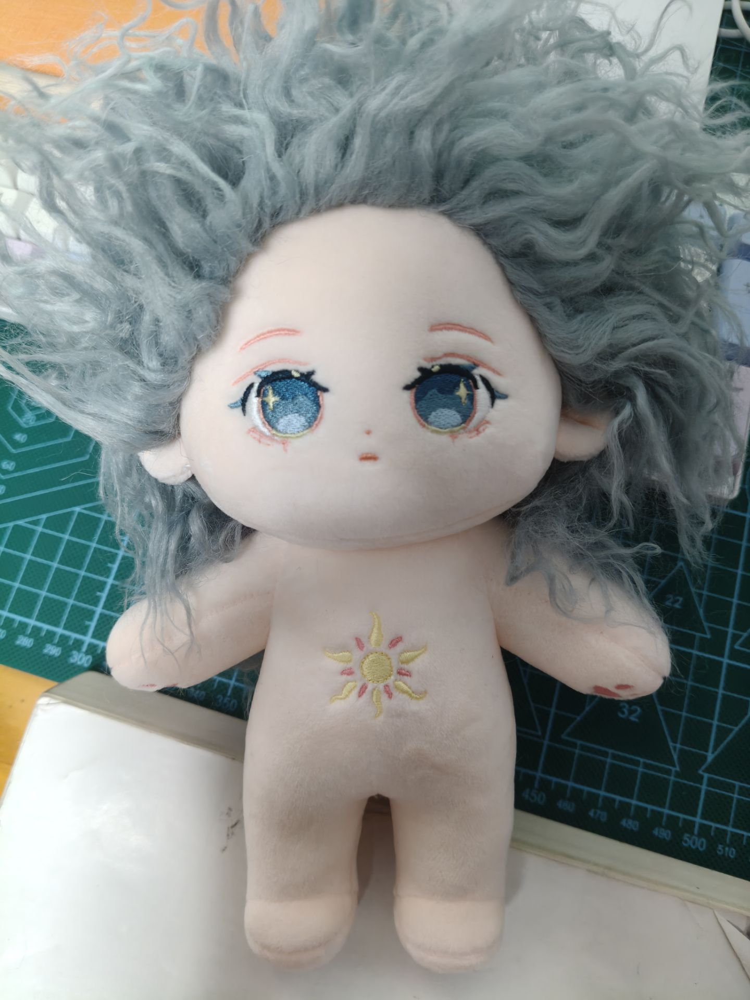

# 2025-9-3石头里的青春期
`小小的红玫瑰啊! 人类深陷巨大的贫乏 人类深陷巨大的痛苦 我多么愿意身在天国!`

我的灼灼玩偶到了(头发有点乱 我还没整理),看着灼灼的海报 回想到了石头里的青春期与我在学校当教父系列

同声相应 同气相求. 这两个系列的视频引发了我强烈的共鸣, 我曾与齐天和布凡有着相同的经历 我们实在是太像了

## 石头里的青春期
我喜欢将自己带入一个世界, 或许它是理想国 或许它是乌托邦.

而在现实生活中 它的一种映射便是游戏.

我的计算机道路的开始其实也起源于游戏, 它能让我忘掉现实中的烦恼(不过那时我的现实生活没有烦恼 只是为了带入另一个世界 这是diff于布凡的地方.)

-> 石房子: 祝你在石房子中 找到属于生活的浪漫...

于是灼灼出场了: 我的名字不好听 你叫我灼灼吧!.. 桃之夭夭 灼灼其华的灼灼...

在石头里的青春期系列里 充满着压抑与救赎. 这种极致的落差令人潸然泪下.

也许不是所有的结局都会完美 不是所有美丽的花都会绚烂的开放, 但这波折的过程 泥泞中的挣扎 痛苦中的重生 才是人世间最美的光.

看到这结局 我久久不能释然. 我知道这才是现实中的结局 我也知道这才是现实中的大多数

但我希望看到光 我希望能看到天国 ,它让我思考: 我该如何救赎自己? 

也许无法得到救赎. ----- `世浑浊而嫉贤兮 好敝美而称恶`

突然地 我想到了屈子. 当世界上最高洁的心陷入最污秽的境地中 虽然他没有改变现实, 但他在追求理想过程中所散发的理想主义光芒在这片传奇的土地上播下了种子 在后世永恒的照耀四方.

致敬梦格尔老师创作的人物与故事 它抚摸着我的内心.

