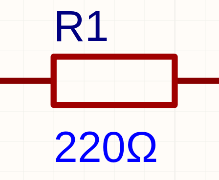
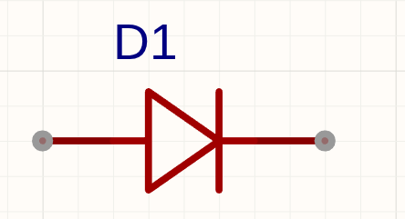
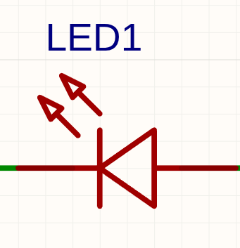
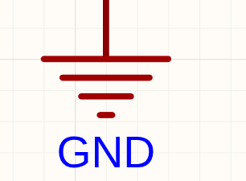
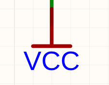
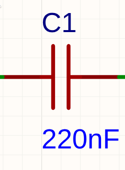

# EE
电气
## 基本元器件

### 电阻
- 符号: `R`

- 图片: 

- 作用: 就是电阻
### 二极管
- 符号: `D`

- 图片: 

- 作用: 允许电流朝一个方向流动. 即正向(三角形的尖端)导电 反向(三角形的边)基本不导电
### 发光二极管
- 符号: `LED`

- 图片: 

- 作用: 会发光的二极管
### GND
- 符号: `GND`

- 图片: 

- 作用: 地线, 0v参考点
### VCC
- 符号: `VCC`

- 图片: 

- 作用: 电路的正电源网络 也就是到GND的电压
### 电容
- 符号: `C`

- 图片: 

- 作用: 存储电荷 对电压变换进行缓冲. 在现实中 芯片突然工作的时候 电源电压可能会出现小波动 , 电容可以把它缓冲然后压平.
