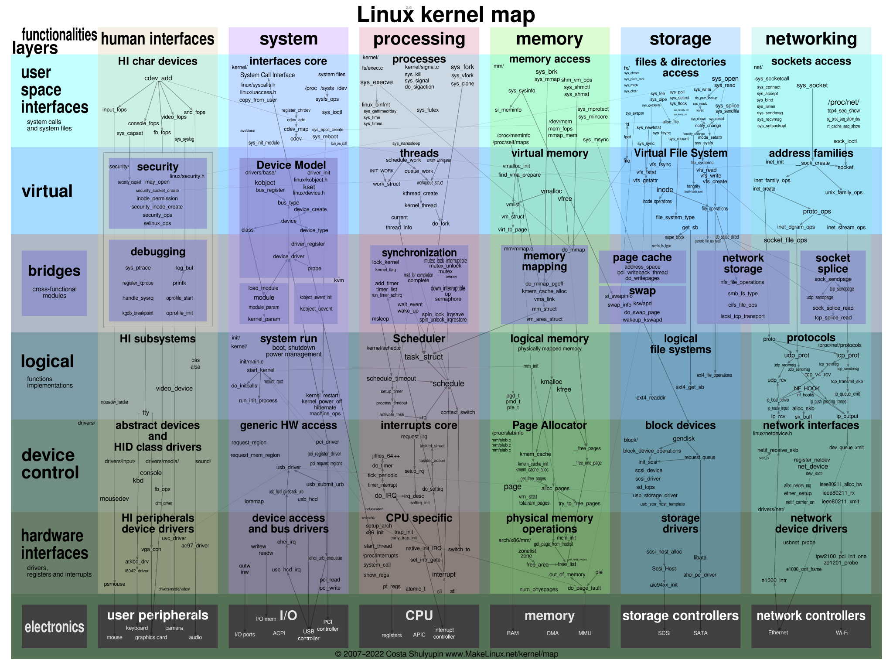

# Linux内核

## 内核结构


在这个架构图中 Linux被拆解为5个部分: 用户接口(human interfaces) 系统(system) 进程管理(processing) 内存管理(memnory) 存储管理(storage) 网络管理(networking)

而这五个部分又被分为7个层级: 
- 用户空间接口(userspace interfaces)[这里面包含了系统调用和系统文件] 
- 虚拟(virtual)[主要表示内核中的逻辑抽象] 
- 桥接(briges)[连接转换不同的抽象层次] 
- 逻辑层(logical)
- 设备管理层(device control)
- 硬件接口(hardware interfaces)
- 设备层(electronics)
### human interfaces

## 编译内核

### 编译内核与模块
```shell
make all
```
### 安装内核与模块
```shell
  make INSTALL_MOD_STRIP=1 modules_install
  make install
```

### 生成initramfs
```shell
dracut --force --no-hostonly initramfs-6.12.27-barrensea.img 6.12.27-barrensea 
```


## 内核参数(启动时)
当前内核的命令行参数`/proc/cmdline`

- init: 运行制定的二进制文件作为init进程
- initrd: 指定初始的ramdisk位置
- cryptdevice: 指定dm-crypt加密分区位置与设备映射器名称
- debug: 启动内核调试
- lsm: 设置linux安全模块的初始化顺序
- maxcpus: 将启用的最大处理器数量
- mem: 强制使用特定数量的内存
- netdev: 网络设备参数
- nomodeset: 禁用kernel mode setting
- acpi_os_name: 告诉 ACPI BIOS 操作系统的名称 格式：要伪装成 Windows 98：="Microsoft Windows"
- acpi_osi: 修改支持的操作系统接口字符串列表
  - "Microsoft Windows XP"
  - "Microsoft Windows 2000"
  - "Microsoft Windows 2000.1"
  - "Microsoft Windows ME: Millennium Edition"
  - "Microsoft WindowsME: Millennium Edition"
  - "Windows 2001"
  - "Windows 2006"
  - "Windows 2009"
  - "Windows 2012"
  - "Windows 2015"
  - "Windows 2020"
