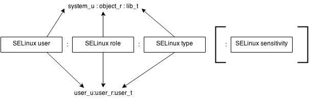

# SELinux
安全增强型 Linux (SELinux) 是适用于 Linux 操作系统的强制访问控制 (MAC) 系统.

SELinux 用于定义对系统上应用、进程和文件的访问控制 它利用安全策略（一组规则，用于告知 SELinux 哪些内容可以访问或哪些内容不可以访问）来强制执行策略所允许的访问。

当应用或进程（称为主体）发出访问某个对象（如文件）的请求时，SELinux 会检查访问向量缓存（AVC），其中缓存了主体和对象的访问权限。

如果 SELinux 无法根据缓存的权限来判断是否允许访问，它会将请求发送给安全服务器。安全服务器随即检查应用或进程和文件的安全环境，确认其是否匹配 SELinux 策略数据库的安全环境。然后，根据检查结果授予或拒绝授予权限。

如果拒绝授予权限，/var/log.messages 中将会显示“avc: denied”消息。
## 上下文
SELinux使用上下文来识别资源

SELinux的上下文由3-4个部分组成
1. SELinux user _u
2. SELinux role _r
3. SELinux type _t
4. 可选的敏感度

大部分的规则都是针对于type进行的

## 策略
SELinux的默认策略是拒绝 因此会在SELinux type上寻找类似白名单的允许语句

SELinux 策略定义了 SELinux 子系统的行为。不同的策略会导致系统行为的差异。

