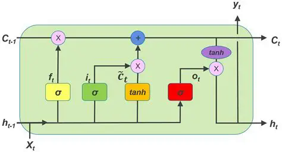
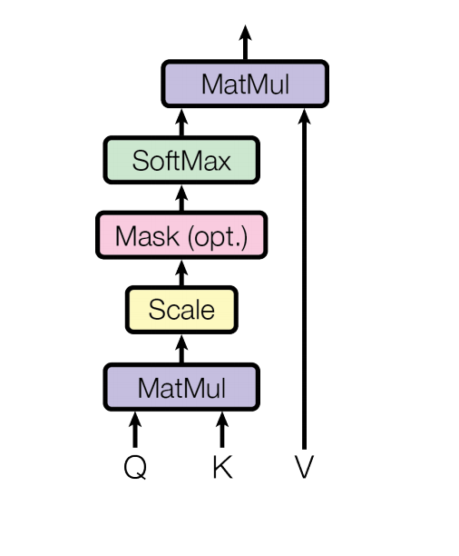
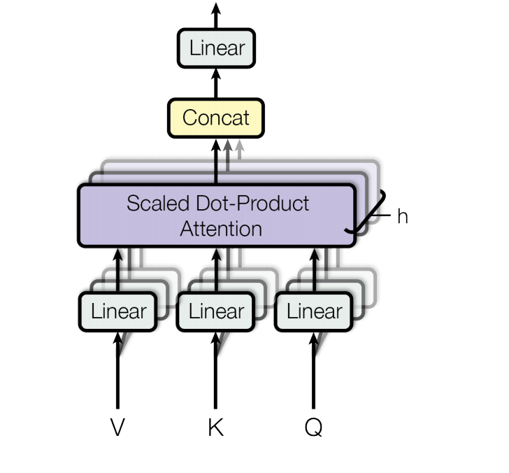
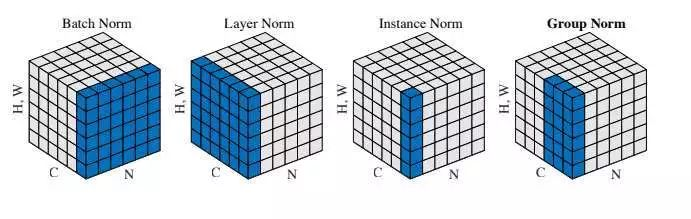
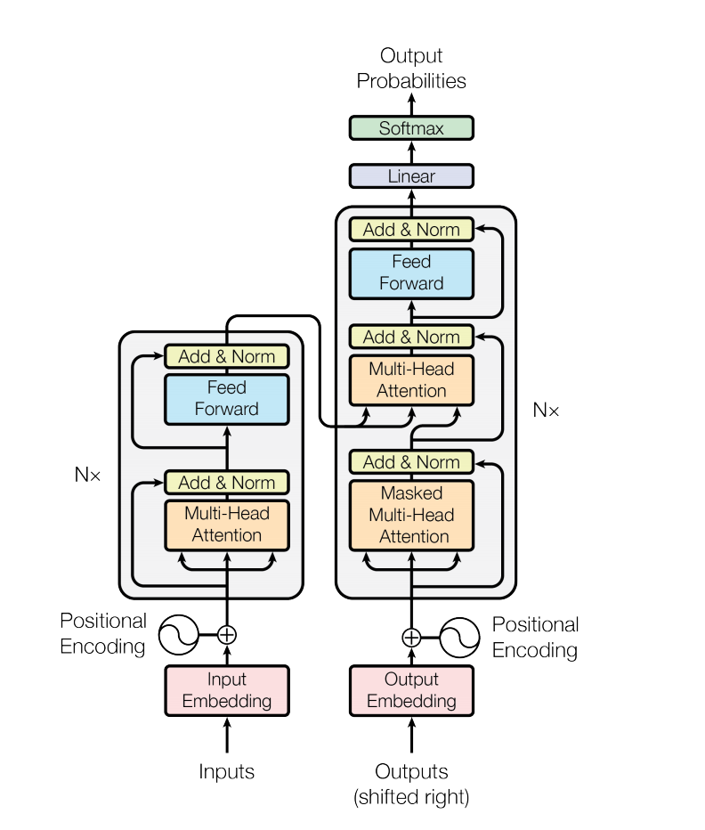
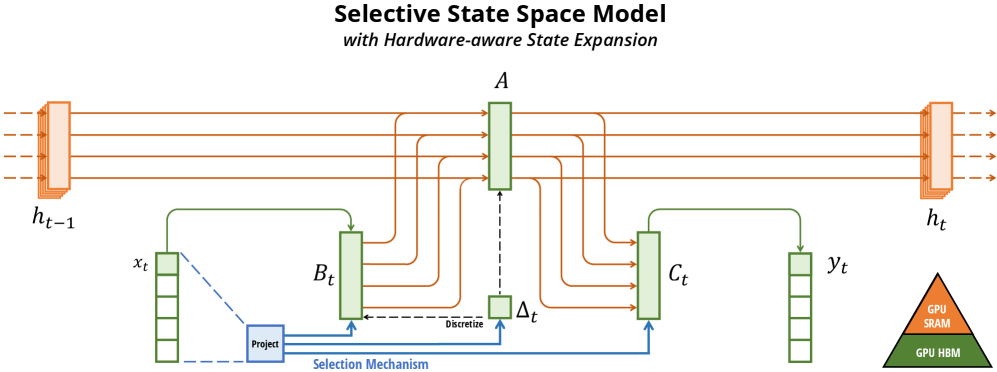
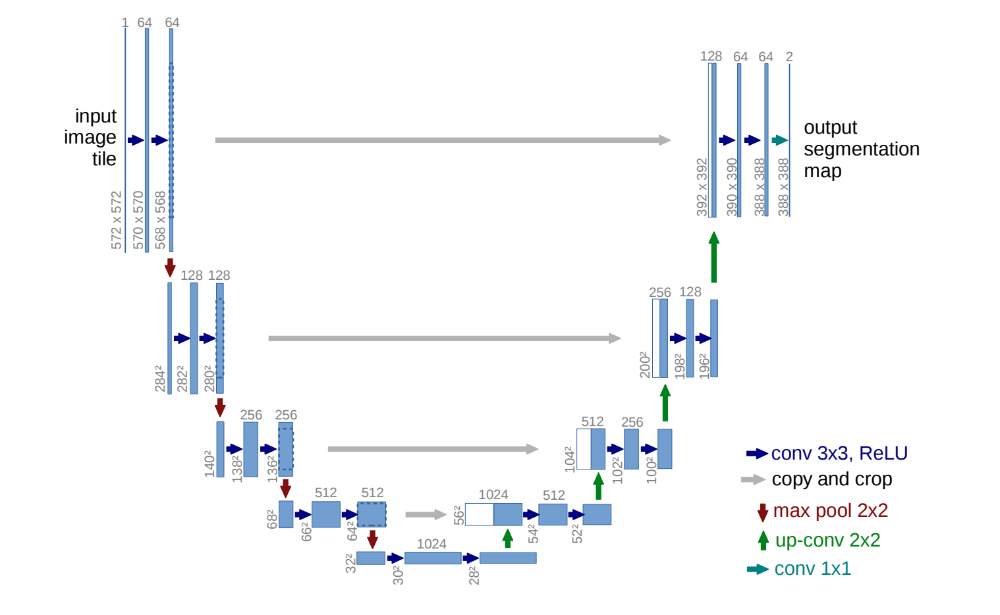
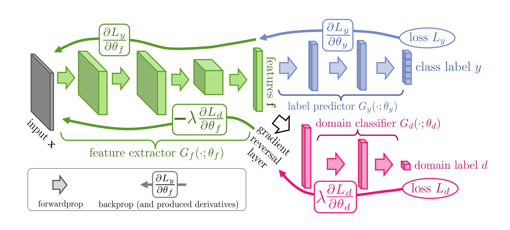

# ML
## Todo
- KL散度
- K近临
- 桥回归
- 岭回归
- FNO
- VAE
- 算子神经网络
## 神经网络
神经网络的本质是

`神经网络是一个通过优化学习参数，以逼近（或拟合）任意复杂函数的通用非线性映射器`

可以把神经网络看作一种把输入空间映射到输出空间的几何变换。

每一层线性变换 + 非线性激活，使数据在高维空间中逐渐变得“线性可分”。

- 线性层负责旋转 拉伸 平移
- 激活函数负责弯曲空间 使模型表达非线性边界

**那为什么不用其他数学方法逼近?**
数学里面有那么多逼近函数的方式: Taylor展开 Lagrange插值 傅立叶....

其他数学方法的泛化能力都非常的弱 比如逼近sinx. 拉格朗日插值就会在边界震荡 而神经网络可很好的泛化
### 过程
机器学习的过程 以一个只有线性层为例

假设我们的模型只有一个线性层: $y = w x + b$
#### 初始化
在神经网络的开始 我们会对神经网络的参数进行**有规律的随机初始化**(可能是纯随机 或者是带分布的初始化)

那么实际上当x是一维标量的时候 这就是一个直线.

我们先随机化w和b. 然后来进行一次前向传播预测

#### 前项传播
我们的输入是几个不同的x 比如x=1 x=2 x=3...

假设我们在初始化的适合 w=2 b=1

那么有

$$
y = 2x + 1
$$

我们前向传播得到的结果是 y = 3 , 5 , 7....

#### 损失函数
我们从输入得到了模型的预测值: [3,5,7]

这个时候我们需要一个**标准来衡量模型的预测和实际的差距**

来衡量模型的预测和实际的差距的就是损失函数

比如一个损失函数MAE 把真实值和预测值的绝对值的差加起来

假设我们的模型的真实值应该是[2,4,6]

那么

$$
MAE_LOSS = |2-3| + |4-5| + |6-7| = 3
$$

而我们模型的训练的目的就是通过梯度下降来减少预测值和真实值的差距. 所以要降低loss的值

而为了得到损失函数关于每个参数的梯度 **所以我们要求损失函数可导**
#### 梯度下降
我们这里拿MSE损失举例

MSE是在MAE的基础上给差值加个平方.

$$
MSE_LOSS = \sum(w x + b - y_true)^2
$$

现在我们需要**分别**修改w和b 来减少这个函数值

先来调整w

来复盘一下我们现在知道什么: 

这一点的w,b,x,y_predict,y_true 所以我们可以**关于LOSS对w求导**

但是注意 我们只是有了这一点关于w的**导数** **它仅能反应函数大概的趋势**

首先我们肯定知道是往斜率朝下的地方去调整w 但是调整多少的策略由**优化器决定**

b也同理看成LOSS关于b的一元函数 然后求导得到LOSS关于b的导数
#### 优化器
在上一步中 我们得到了损失分别关于w和b的导数

那么如何通过导数来调整w和b呢

通过这个通式

$$
w_new = w - \theta \frac{dLoss}{dw}
$$

b同理

一般$\theta$就是学习率

但是$\theta$的策略根据不同的优化器和学习率不同

根据优化器给出的策略 我们调整了w和b 于是重复这个过程 直到更好的拟合 这就是机器学习

#### 代码
我们用一个MLP来拟合一条复杂的曲线

$$
e^{-0.1 * x} * sin(2x) + 0.1 x^3 - 3 x^2 + 2x
$$

#### 模型
首先我们定义一个MLP模型
```python
class MLP(nn.Module):
    def __init__(self, input_dim, hidden_dim, output_dim):
        super(MLP, self).__init__()
        self.fc1 = nn.Linear(input_dim, hidden_dim)
        self.fc2 = nn.Linear(hidden_dim, output_dim)
        self.relu = nn.ReLU()

    def forward(self, x):
        x = self.fc1(x)
        x = self.relu(x)
        x = self.fc2(x)
        return x
```
它具有2层全连接层 其中第一个全连接层后面连接了一个**非线性**的激活函数,有了非线性的函数才能拟合曲线.

forward是模型的**前向传播**的过程 先经过`fc1` 然后经过`relu`激活函数 最后过一层`fc2`

#### 数据集的处理
在这里我们的数据集是 x为函数的横轴 y为函数值

```python
def target_function(x):
    return np.exp(-0.1 * x) * np.sin(2 * x) + 0.1 * x**3 - 3 * x**2 + 2 * x
	
x_data = np.linspace(-5, 5, 100)
y_data = target_function(x_data)

x_tensor = torch.tensor(x_data,dtype=torch.float32).view(-1,1)
y_tensor = torch.tensor(y_data,dtype=torch.float32).view(-1,1)

```

#### 优化器和损失函数
我们选择优化器和损失函数
```python
criterion = nn.MSELoss()
optimizer = optim.Adam(model.parameters(),lr=0.001)
```


#### 开始训练
每一次训练的过程是: 

```
梯度清零 -> 正向传播得到预测值 -> 使用损失函数根据预测值和真实值计算损失 -> 将损失进行反向传播 更新模型的参数
```

```python
for epoch in range(epochs):
    model.train()
    optimizer.zero_grad()
    y_pred = model(x_tensor)
    loss = criterion(y_pred, y_tensor)
    loss.backward()
    optimizer.step()
```

#### 使用模型
```python
model.eval()
y_mlp_pred = model(x_tensor).detach().numpy()
```
### 通用近似定理
UAT:Universal Approximation Theorem

UAT证明了神经网络逼近任意函数的**正确性**和**可行性**

UAT的通俗解释: 神经网络在**足够的神经元数量和至少一层hidden layer**可以近似欧几里得空间上的任意函数

## 回归和分类
回归和分类是机器学习的基本任务

- 回归主要用于预测**连续**的数据

- 分类主要用于预测**离散**的数据
### 线性回归
线性回归是一个**回归**模型 是用一条直线来拟合

假设我们的样本是$\mathbf{X} \in \mathbb{R}^{N \times n}$ 权重是$w \in \mathbb{R}^{n \times 1}$ 预测值是$\hat{y} \in \mathbb{R}^{N \times 1}$

其中样本矩阵X代表有N个样本 每个样本有n个特征

$$
\mathbf{X} =
\begin{bmatrix}
x_{11} & x_{12} & \cdots & x_{1n} \

x_{21} & x_{22} & \cdots & x_{2n} \

\vdots & \vdots & \ddots & \vdots \

x_{N1} & x_{N2} & \cdots & x_{Nn}
\end{bmatrix}
$$

$$
w =
\begin{bmatrix}
w_1 & \
w_2 & \
\vdots & \
w_n &
\end{bmatrix}
$$

$$
\hat{y} = \mathbf{X} w + b
$$
#### 先验假设
真实的数据应该长这样

$$
y = \mathbf{X} w + b + \epsilon
$$

其中$\epsilon$是噪声

根据**中心极限定理**我们一般假设它**服从高斯分布**

$$
\epsilon \sim \mathcal{N}(0,\sigma^2)
$$

#### 损失函数
线性回归一般使用**残差平方和RSS** 也就是MSE不做平均

$$
RSS(w,b) = \| y - \hat{y} \|^2 = \| y - b - \mathbf{X} w \|
$$

#### 最小二乘
在线性回归问题 **是有直接的闭式解的**(在大多数前提满足下) 因为最小二乘是一个严格的二次函数的凸优化问题

我们只需要求解这个线性方程就能得到闭合解

$$
w = (\mathbf{X}^T \mathbf{X})^{-1} X^T y \
b = \tilde{y} - \tilde{x}^T w
$$
#### 梯度下降
虽然最小二乘可以直接用闭式解得到最优的w和b 但是是具有一些限制的 比如矩阵要可逆等

而且若样本和特征很大 我们需要很多的计算

所以我们仍然可以使用梯度下降来拟合直线
#### 代码
```python
import torch
import torch.nn as nn
import torch.optim as optim
class MyLinear(nn.Module):
    def __init__(self):
        super().__init__()
        self.w = nn.Parameter(torch.randn(1))
        self.b = nn.Parameter(torch.zeros(1))

    def forward(self, x):
        return self.w * x + self.b # y = wx + b
    
torch.manual_seed(42)
n = 100
X = torch.rand(n) * 10
Y = 20.0 * X + 33.3 + torch.randn(n)

X = X.unsqueeze(1)
Y = Y.unsqueeze(1)


model = MyLinear()
criterion = nn.MSELoss()  # 均方差损失
optimizer = optim.SGD(model.parameters(), lr=0.01)

for epoch in range(1000):
    pred = model(X)
    loss = criterion(pred, Y)

    optimizer.zero_grad()
    loss.backward()
    optimizer.step()

    if epoch % 100 == 0:
        print(
            f"{epoch}: loss={loss.item():.4f}, "
            f"w={model.w.item():.4f}, "
            f"b={model.b.item():.4f}"
        )
```
### 逻辑回归
逻辑回归是一个**回归**模型 是用sigmoid曲线来拟合概率

逻辑回归是在预测一个二分类结果

$$
p(y=1|X) = \sigma (\mathbf{X} w + b)
$$

我们可以看出 相当于在线性模型上套了一个sigmoid函数
#### 损失函数
逻辑回归的损失是**交叉熵**的二分类版本

我们知道 交叉熵的公式是

$$
H(p,q) = - \sum_{i=1}^{n} p_{i} log{q_{i}}
$$

在二分类问题我们有

真实的分布是

$$
p(y) = 
\begin{cases}
y (y=1) & \
1-y (y=0) &
\end{cases}
$$

模型的预测是

$$
q(y=1) = \hat{p} & \
q(y=0) = 1 - \hat{p} &
$$

我们带入交叉熵可以得到

$$
-[y log \hat{p} + (1-y) log(1-\hat{p})]
$$
#### 代码
```python
class LogisticRegression(nn.Module):
    def __init__(self):
        super().__init__()
        self.w = nn.Parameter(torch.randn(1))
        self.b = nn.Parameter(torch.zeros(1))

    def forward(self, x):
        z = self.w * x + self.b
        return torch.sigmoid(z) ## y = sigmoid(wx + b)
n = 200    
X = torch.rand(n) * 10
Y = (X > 5).float()   

X += torch.randn(n) * 0.3

X = X.unsqueeze(1)    
Y = Y.unsqueeze(1)    

model = LogisticRegression()
criterion = nn.BCELoss() # 交叉熵的二分类特殊版
optimizer = optim.SGD(model.parameters(), lr=0.1)
epochs = 1000

for epoch in range(epochs):
    pred = model(X)               
    loss = criterion(pred, Y)

    optimizer.zero_grad()
    loss.backward()
    optimizer.step()

    if epoch % 100 == 0:
        print(
            f"{epoch}: loss={loss.item():.4f}, "
            f"w={model.w.item():.4f}, "
            f"b={model.b.item():.4f}"
        )
with torch.no_grad():
    probs = model(X)
    preds = (probs > 0.5).float()

accuracy = (preds == Y).float().mean()
print("accuracy:", accuracy.item())

    		
```
## Tensor
张量

`!注意 与物理学中的张量不一样`

张量在存储结构上来说就是一个多维数组 是对矩阵的更高维度的推广

张量的存储包含了张量的形状 张量的实际内容
### 形状
n维张量的形状是一个`n个元素的元组`

- `shape(a)` 这是一个有a个元素的向量
- `shape(a,b)` 这是一个a行b列矩阵
- `shape(a,b,c)` 这是一个a块b行c列矩阵 相当于有两个shape(b,c)

在CNN中 通常使用4维张量: `shape(n,c,h,w)`

其中n为batch c为channels h为high w为weight

比如32张64*64的RGB图片

$$
shape = (32,3,64,64)
$$

### 张量形状的底层存储
张量是行优先原则

以CNN为例

```
[
  [  # 第1张图片
	# R通道
    [
	# 2*2矩阵
	[a,b],
     [c,d]
	 ],
    # G通道
    [[e,f],
     [g,h]],
	 # B 通道
	 [[m,b],
	 [p,q]],
  ],
...
]

```

然而在计算机中存储为线性的结构[a,b,c,d,e,f,g,h,m,b,p,q....]

所以需要去索引
#### 索引
我们只需要一个 stride 即一个步幅 就能精确索引了

shape=(a,b,c,d) 而stride[i] 会告诉你 在i维上走1步 实际上是在线性数组中走几步

我们不难的发现
```
stride[3] = 1
stride[2] = d
stride[1] = c * d
stride[0] = b * c * d
```

所以假设我需要访问元素(n,c,h,w) -> `offset = n * 1 + c * d + h * (c * d) + w * (b * c * d)`
### 矩阵乘积形状判断
当且仅当前一个矩阵的列数n等于后一个矩阵的行数m时 两个矩阵的乘积为m*p矩阵

$$
A_{mxn}  B_{nxp} = C_{mxp}
$$
### 正态分布
在初始化时 经常使用正态分布 因为正态分布`更自然而稳定 多数聚集在0附近 少量较大值`
```rust
// 以0.0为均值 0.02为标准差 创建input_dim行 hidden_dim列矩阵
let tensor = Tensor::randn(0.0,0.02,(input_dim,hidden_dim))?;
```
### 哈达玛乘积
对于两个具有相同维度的矩阵,它们的哈达玛乘积为逐元素相乘

$$
(A \circ B)_{ij} = A_{ij}  B_{ij}
$$
### 点积
点积反应的意义是: 张量x在y方向上的投影再与y的乘积, 能够反应两个张量的`相似度`

*点积越小 相似度越小*
## 卷积
上卷积在深度学习中 可理解为特征提取

可以理解为用卷积核在输入的矩阵上滑动. 将重合的部分相乘然后分别相加 求和的结果放到新的矩阵 (即为 输入的特征和卷积核的特征进行相似度的匹配)

```
矩阵     卷积核        
1 2 3     2 -1
4 5 6     1  2       
7 8 9

滑动
1 2   2 -1   ->  1 * 2 + -1 * 2 + 4 * 1 + 5 * 2
4 5   1  2

```


一个 m * n 的矩阵 与 a * b的卷积核卷积 得到一个 (m - a + 1) * ( n - b + 1)的矩阵

即

### 离散卷积

$$
y_t = \sum_{k=0}^{t} h_k x_{t-k}
$$

卷积性质
- 线性性质
- 平移不变性

#### 与傅立叶变换

$$
y = h * x
$$

$$
F(y) = F(h) \circ F(x)
$$

即 h和x的卷积的傅立叶变换 等于h的傅立叶变换 和x傅立叶变换的哈达玛乘积

### 一维卷积
一维卷积可以理解为卷积核是一个**滑动窗口** 然后在被卷积的序列上滑动 然后加权相加

若输入是(N,in_channel,in_len)

则输出(N,out_channel,out_len)

其中

$$
out_len = \lfloor \frac{in_len + 2 * padding - dilation * (kernel_size - 1) - 1}{stride} + 1 \rfloor
$$
### 二维卷积
二维卷积就是CNN中用的卷积 卷积核是矩形 

若输入是(N,in_channel,in_high,in_weight)

输出为(N,out_channel,out_high,out_weight)

其中

$$
out_high = \lfloor \frac{in_high + 2 * padding - dilation * (kernel_size - 1) - 1 } {stride} + 1\rfloor
$$

out_weight同理

### 反卷积
反卷积就是卷积的相反操作

将特征通过卷积核还原

### 卷积核
在神经网络中 卷积核一开始是随机的 而在模型训练的过程中通过反向传播等进行更新.

`所以模型训练的过程之一可以说就是在更新和确定卷积核`

不同卷积核可提取出不同的特征: 如类似Laplace的卷积核用二阶导近似算子检测灰度突变位置  而类似Guass的卷积核抑制噪声，高频信息被压制。

## 转置卷积
转置卷积是卷积的逆过程 基于较小的特征图 生成较大的特征图
## 池化
### 最大池化
池化是对卷积后结果的一次"抓重点"

池化和卷积一样 也有一个池化核 同时也是在矩阵上滑动.

区别是池化核的矩阵只是一个框框 一个形状 里面没有任何特征.

池化的过程是这样的: `在经过卷积后 得到了特征矩阵. 我们使用池化核框框在这个矩阵上滑动 每次取这个框框里的最大值放到新的矩阵里`

然后滑完后得到的新的矩阵就是池化结果

我们不难的发现 一个m*n 矩阵 与 a * b的池化核池化 得到一个 (((m - a) / a)的向下取整+1) * (((n - b ) / b)的向下取整 + 1)

池化的公式

$$
输出矩阵的高 = \frac{原矩阵的高 + 2 * 填充 - 池化核的高}{步长} + 1
$$
### 平均池化
平均池化和最大池化的区别是 平均池化是把区域内的数取平均而不是取最大值
### 分数最大池化
分数最大池化是最大池化**池化核**的**比例不是固定**的版本 普通的最大池化的池化核的边长是整数

**而分数最大池化的边长是分数**

**分数最大池化是通过随机选择步长,让步长的平均值约等于分数边长的方法**
### LP池化
LP池化是通过对池化核的框框内的元素进行计算$L_p$范数的方法

$$
output = \sqrt[p]{\sum_{x \in X} x^p}
$$

## 全连接层
神经网络的分类器

这是整个层的公式

$$
y = W x ^ T + b
$$

### 每个神经元
神经元是全连接层的基本单元

假设神经元从上一层接收n个输入信号$x_1,x_2,...,x_n$

每个对应的$x_i$都有对应的权重$w_i$ 神经元计算加权和

$$
y = \sum^{n} w_i x_i + b
$$

我们把输入$x_i$ 权重$w_i$看成行向量

$$
X = [x_1,x_2,...,x_n] \\
W = [w_1,w_2,...,w_n] \\

$$

于是

$$
y = \sum^{n} w_i x_i + b = W X^T + b
$$
### 在CNN中
全连接层输出对分类的`预测分数logits`

logits的张量为: `shape(batch_size,n)`


其中x为图片展平后的向量 W为权重矩阵shape[out_size,in_size] b为偏置向量shape[out_size]


我们知道 输入的向量是一个1 * in_size形状的矩阵

根据矩阵的乘法 我们有

$$
W_{nxb} x_{1xn} = out_{1xb}
$$


全连接层的输入张量是二维的`shape(batch_size,n)`


在初始时 W和b是随机的(形状不随机) 而在模型训练过程中通过反向传播等进行更新

`所以模型训练的过程之一可以说就是在更新和确定全连接层参数`

在Mnist CNN中 使用了两个全连接层

第一层linear(in_dim,out_dim): in_dim为池化后的张量shape(num,dim)中的dim out_dim为第一次粗分类


而第二层linear(out_dim,out_dim2): 把第一层的分类结果分类为最后的out_dim2
## 损失函数
$$
L(x_i,y_i,\theta)
$$

其中
- x_i: 第i个输入样本
- y_i: 这个样本的标签
- $\theta$: 模型参数
- L: 损失函数

选用不同的损失函数可以适用于不同的场景:

比如如果数据集中有异常值 可以适用鲁棒性的损失函数HuberLoss

如果输出和输入不对齐 可以适用CTCLoss

如果先验假设预测值服从高斯分布 使用MSE, 服从泊松分布可以使用PoisonNLL, 服从伯努利可以使用BCE
### NLL/CrossEntropy
负对数似然与交叉熵 核心在于**最大化正确类别的概率**
#### NLL
负对数似然损失 适用于**单标签分类**

它希望模型给正确类别分配的概率越高越好，错的越低越好。

真实标签是索引y 其中p是**对数概率**

$$
NLLLoss(p,y) = - log(p_{y})
$$

即取出真实类别对应的预测概率$p_{y}$

与交叉熵损失的联系

$$
CrossEntropyLoss(z,y) = NLLLoss(log_softmax(z),y)
$$
##### 示例
```python
import torch.nn.functional as F
logits = model()
log_logits = F.log_softmax(logits,dim=1)
criterion = nn.NLLLoss()
loss = criterion(log_logits,labels)
```
#### CrossEntropy
交叉熵 用于 **分类任务** 的常用损失函数 **适用于单标签分类** 是NLL的改进

它衡量的是 **真实标签与 预测概率分布 之间的差异** 差异越小 模型性能越好

如果模型正确预测了类别，损失会小（概率接近 1，log(1) = 0）。

如果模型错误预测了类别，损失会大（概率接近 0，log(0) 会趋近负无穷）

假设我们有一个n分类问题 给定一个真实标签的分布p和概率函数(一般是softmax)输出的概率分布q 满足:

$$
H(p,q) = - \sum_{i=1}^{n} p_{i} log{q_{i}}
$$

- $p_{i}$是真实标签的概率分布 通常是一个one-hot向量(即除了真实的标签的数组下标为1 其他为0)
- $q_{i}$是模型预测的概率分布 通常是通过softmax得到的概率分布
##### 示例
```python
logits = model()
criterion = nn.CrossEntroypyLoss()
loss = criterion(logits,labels)
```
#### 适用场景
1. 适用于单标签分类 不适合回归任务

NLL和CrossEntropy的目标在于 **匹配类别的概率** 优化目标在于 **最大化正确类别的预测概率**

NLL/CrossEntropy要求的target向量是one-hot的 所以不是连续的 所以不适合回归

2. 对样本数量要求平衡(若一个样本数远大于其他类别的样本 那么权重会很高) 

这是pytoch对batch的loss公式

$$
Loss_{batch} = \frac{1}{n}\sum_{n=1}^{n}Loss_n
$$

假设一个batch有90个是类别A 10个是类别B 那么计算梯度时 A会贡献90%的梯度 模型很不容易学习B 所以要求样本数量是差不多的


3. 对小概率很敏感 若概率接近0 则LOSS会很大 需要对数值稳定进行处理

我们不难发现 当p -> 0 时, 负对数趋近于无穷 所以若模型预测正确类别的概率非常低 那么LOSS会非常大

### MSE/MAE
均方误差和平均绝对损失 适用
#### MSE
均方误差损失

$$
L = \frac{1}{n} \sum_{i=1}^{n}(y_i - \hat{y_i})^2
$$

其中
- $y_i$是真实值
- $\hat{y_i}$是模型预测值
- $n$是样本数量

在这种情况下，损失函数度量的是预测值与真实值之间的差异，模型的目标是最小化这个损失。

MSE对异常值是**很敏感**的 因为平方项的存在 异常值会被放的很大

#### MAE
平均绝对损失

L = \frac{1}{n} \sum{i=1}^{n}|y_i - \hat{y_i}|

**对大误差没有MSE敏感 没有MSE平滑 数值稳定性比MSE高 梯度恒定**
#### 适用场景
### BCE
二分类问题的交叉熵损失

常用于GAN 因为GAN就是二分类问题

$$
BCE = -[y \log D(x) + (1-y) \log(1-D(x))]
$$
#### 适用场景
一般用于二分类的逻辑回归

### CTC
输入序列和输出标签长度不对齐 没有逐帧标注的模型的损失函数 **输入长度要大于等于输出长度**

原理是: **输入到目标的可能对齐的概率进行求和** 生成一个相对于每个输入节点可微分的损失值 

比如语音识别 手写识别 ocr
#### 适用场景
一般用于输入输出不对齐的模型

### PoissonNLL
服从泊松分布时用的NLL

**也就是说当标签是计数 并且方差约等于均值时** 适用PoissonNLL
### GaussianNLL
服从高斯分布时用的NLL

MSE是GuassianNLL的特例

### KLDiv
KL散度

用分布Q去近似分布P时 多付出的信息代价 可以衡量两个概率分布之间的相似性

说到两个分布的相似性 你可能会回想起MMD

MMD是把分布映射到再生希尔伯特空间 然后得到两个分布的距离

而KL散度是**似然驱动的概率建模**

输入必须是log-prob

#### 适用场景
- 知识蒸馏(小模型学习大模型的输出概率分布)
- 软标签: 把one-hot平滑化 防止模型过拟合或者极度自信
- 概率分布预测: 模型预测的是一个分布 而不是单纯的一个点


### HuberLoss
鲁棒性的损失 结合了MSE和MAE的优点

在元素间的差小于delta时使用平方类似MSE 否则使用delta缩放MAE

$$
Loss = 
\begin{cases}
0.5(x_n - y_n)^2, & |x_n - y_n| < delta \

delta(|x_n - y_n| - 0.5delta), & |x_n - y_n| >= delta
\end{cases}
$$
## 梯度下降
通过沿着损失函数的梯度的反方向更新参数来减少损失函数的值

$$
\theta = \theta - \eta \cdot \frac{\partial L}{\partial \theta}
$$

其中
- $\theta$是需要更新的参数 比如权重 偏置
- $\eta$是学习率
- $\frac{\partial L}{\partial \theta}$是损失函数关于参数的梯度


### 随机梯度下降
在每一次更新中随机抽取样本来梯度下降 可节省内存
## 学习率
学习率控制着模型在训练过程中每次参数更新的步长大小 即在使用梯度下降（或其变种）更新神经网络参数时 调整的幅度 所以学习率极大影响着梯度下降核反向传播的过程


## 反向传播
深度学习的可行性建立在 *每个参数的输出对损失的可导性*
在拿到前向传播得到的损失函数后 通过损失函数对神经网络的卷积层或全连接层的参数求偏导 一层层的使用链式法则偏导过去 

然后根据学习率 来更新参数的值

这就是反向传播
## 数据集
在训练模型时 我们会把数据分成两到三个部分
| 名字             | 缩写           | 意义                                              |
|------------------|----------------|---------------------------------------------------|
| 训练集           | training set   | 学习的样本 就是实际训练的数据                     |
| 验证集(optional) | validation set | 用来在训练中`调参`或`防止过拟合`的样本 不用于训练 |
| 测试集           | test set       | 评估的样本 不用于训练                                                  |
训练集不必多说

### 验证集
验证集可以`帮助调整模型结构、超参数`

超参数的调整一般不会使用训练集来判断 因为如果你用训练集评估超参数，那么模型会倾向于“记住”训练集的规律，而不是真实的规律。


### 数据集处理
在训练前 是需要对数据集进行预处理的

比如图像切割,图像转化为张量,图像标准化
#### 调参
一般在每个epoch后在验证集上评估准确率或损失

- 若验证集准确率不升反降 → 说明学习率太高或过拟合；
- 若验证集损失下降 → 模型正在学习；
- 若验证集损失稳定 → 可以提前停止训练（early stopping）

#### 防止过拟合
验证集可以帮我们实时监控模型的泛化性能。

常见的做法
- Early stopping（提前停止）： 当验证集损失连续几轮不再下降时 就停止训练
- 学习率调整（Learning Rate Scheduler）： 如果验证集性能变差 → 降低学习率。
- 正则化强度调整（Dropout, Weight Decay）: 通过验证集效果判断是否正则化太强或太弱。
## 过拟合
模型在训练集上表现非常好，但在没见过的数据（测试或验证集）上表现很差。
即：它“背题”了，没有真正学会规律。

当验证集损失开始上升而训练集仍下降时，就是过拟合的信号。
## 正则化
在损失函数中加“惩罚项” 给模型加一点「约束」，让它不要太依赖训练集的细节，而去学更通用的规律。

普通的损失函数

$$
L = Loss(data,model)
$$

正则化后的损失函数

$$
L = Loss(data,model) + \lambda x Regularization term
$$

- $\lambda$: 正则化强度(超参数)
- Regulartization term: 惩罚模型太复杂的部分
## 超参数
超参数是我们需要手动调整的值 重要影响模型的训练

- 学习率
- 批大小
- 网络层数
- 卷积核大小
- 随机失活Dropout比例
- 优化器类型(Adam/SGD)
- 正则化系数(weight_decay)
- 训练轮数(epoch)
## 随机失活
DropOut

在训练时随机“丢掉”一部分神经元（不参与前向传播和反向传播）

可使每次训练让网络“看”的神经元子集不同，防止不同神经元之间过度依赖。
## 数据增强
data augmentation

对输入图像做随机旋转、裁剪、翻转等，让模型“见多识广”，不过拟合。
## 优化器
优化器决定模型的参数是如何根据损失函数更新

优化器是负责更新模型参数的算法

### SGD
随机梯度下降

有时会加入动量 来使下降更平滑

损失函数是 $L(\theta)$ 模型参数是 $\theta$

则SGD算法为

$$
\theta_{t+1} = \theta_{t} - \eta \cdot \nabla_{\theta} L(\theta_{t})
$$

其中
- $\eta$是学习率
- $\nabla_{\theta}L$是损失函数对这个参数的**梯度**

#### 动量
若加入动量Momentum

$$
v_t = \lambda v_{t-1} + \eta \nabla_{\theta}L(\theta_{t}) \

\theta_{t+1} = \theta{t} - v_t
$$

其中
- $\lambda$ 是动量系数 也就是torch的SGD的momentum参数
- $v_t$ 类似速度 累计过去的梯度方向

我们发现 其实加入动量的SGD很像LSTM的门控机制 又很像状态方程

是因为动量保存了之前梯度的**惯性** 是一种缓冲机制

动量在**鞍点**或小斜率区域，会让梯度沿着主方向前进，像门控机制控制信息流向
#### Nesterov
Nesterov Accelerated Gradient NAG

NAG是动量的改进 **它先沿着上一次的速度方向预先移动然后计算梯度**

$$
v_t = \lambda v_{t-1} + \eta \nabla_{\theta}L(\theta_{t} - \lambda v_{t-1}) \

\theta_{t+1} = \theta{t} - v_t
$$

### Adam
最常用的优化器之一


- 每个参数都自动调整自己的学习率；
- 保留历史梯度的均值和方差，更新更平滑；
- 通常训练速度更快、收敛效果更稳定。


### RMSProp
适合非平稳目标(如RNN)

和 Adam 类似，也会自动缩放学习率，但没有动量项

### Adagrad
让稀疏特征更新更快

问题：后期学习率会变得太小，不再学习。

### AdamW
Adam的改进版 加入正则化

目前非常推荐在 Transformer 和 CNN 中使用。

## 概率
将输入转换为概率分布

需要使用概率函数进行输出
### softmax
常见用于多分类问题的最后一层 将模型输出的logits转换为概率分布

常与softmax_crossentropy搭配
特点:
- 使得每个元素表示`对应类别的概率` 且总和为1
- 所有输出压缩到[0,1]

给定一个张良 $z = [ z_{1}, z_{2}, ..., z_{n}]$ 则soft将$z_{i}$会转换为类别概率$p_{i}$

$$
p_{i} = \frac{e^{z_{i}}}{\sum_{j=1}^{n} e^{z_{j}}}
$$

### log_softmax
log_softmax是softmax函数的对数版本 通常用于分类任务的最后一层输出

常与负对数似然损失(NLLLoss)配合 将分类的logits转换为对数概率

log_softmax输出的对数概率小于等于0
$$
log_softmax(z_{i}) = log(\frac{e^{z_{i}}}{\sum_{j=1}^{n} e^{z_{j}}})
$$

化简为

$$
log_softmax(z_{i}) = z_{i} - log(\sum_{j=1}^{n} e ^{z_{j}})
$$

## 激活函数
因为在神经网络中 各种变换都是矩阵间的线性变换 它变来变去永远是直线 那么它永远无法表达曲线

加入非线性的激活函数后 直线会变为曲线 能更好的去逼近曲线

为了**反向传播** 激活函数必须是**可微**的

神经网络的激活函数是很重要的 神经网络拟合的结果是 **激活函数经过线性变换后的叠加**

若不考虑训练速度
```
Mish > GELU(Transformer标配) > SiLU(Swish) > CELU > ELU > SELU* > Softplus > PReLU > LeakyReLU > RReLU > ReLU6 > Tanh > Sigmoid > ReLU
```

### ReLU
$$
f(x) = max(0,x)
$$


常用于CNN

优点
- 计算简单 收敛块
- 避免梯度消失 对正数 导数恒为1
- 稀疏激活 很多神经元输出0 有正则化效果

缺点
- 神经元死亡: 很多神经元<0 则一直梯度为0
- 输出没有上界: 容易梯度爆炸 (最好加个BatchNorm)
- 偏向正区间

#### ELU
我们将负数域改为 $a(e^x -1)$便得到了ELU

$$
ELU(x) = 
\begin{cases}
x,   & x>0 \\
a(e^x - 1),&    x \leq 0
\end{cases}
$$

其中a常设置为1.0


改进版的ReLU
- 正值像ReLU线性增长
- 不会神经元死亡:负值不砍掉 而是使用指数函数 让负值平滑下去 但不会趋于无穷大
- 负值也有输出 更好的正则化
- 比ReLU平滑

缺点:
- 计算慢
- 负区间有饱和区 x很小时 梯度趋于0
#### LeakyReLU
我们将负数域改成 $ax$ 便得到了 LeakyReLU

$$
LeakyReLU(x) = 
\begin{cases}
x , & x > 0 \\
ax, & x \leq 0
\end{cases}
$$

#### PReLU
将LeakyReLU的a从超参数改为可学习参数 便得到了PReLU

$$
PReLU(x) = 
\begin{cases}
x , & x > 0 \\
ax, & x \leq 0
\end{cases}
$$
#### RReLU
把a改成: 在训练期间从上界和下界随机 在推理期间为上界和下界的中值 就是RReLU


$$
PReLU(x) = 
\begin{cases}
x , & x > 0 \\
ax, & x \leq 0
\end{cases}
$$

#### SELU

$$
SELU(x) = \lambda
\begin{cases}
x, & x > 0
a(e^x - 1), x \leq 0
\end{cases}
$$

其中 

$$
a \approx 1.6733 \\
\lambda \approx 1.0507
$$

- 自归一化: SELU可以让神经元的输出在深层网络中保持均值约等于0 方差约等于1

#### CELU
将ELU的$e^x$ 改成 $e^{\frac{x}{a}}$ 就是CELU

$$
ELU(x) = 
\begin{cases}
x,   & x>0 \\
a(e^\frac{x}{a} - 1),&    x \leq 0
\end{cases}
$$

- 处处可导 训练更稳
### tanh

$$
tanh(x) = \frac{e^x - e^{-x}}{e^x + e^{-x}}
$$

常用于RNN

输出范围(-1,1)

优点
- 平滑连续
- 输出有符号 可表示正向记忆 负向记忆

### sigmoid

$$
\sigma(x) = \frac{1}{1+e^{-x}}
$$

优点:
- s形曲线 输入大时饱和于1 小于0时饱和于0 常用于门控LSTM
- 当输入的从左到右时 输出从平缓到加速再到平缓(从导数图可以看出来)
- sigmoid的导数在(0,0.25]

缺点:
- 在x大的时候容易数值下溢 梯度消失: $e^{-x}$ 在x很大时会直接超越浮点数的范围变成0 **此时梯度也会直接消失**
- 输出不是以0为中心 输出很偏**正数**: 使得梯度偏向同一方向 使得梯度下降的效率变差
- 计算开销大 有exp
- 容易数值不稳定 x很大和很小会都容易NaN
#### LogSigmoid
给sigmoid加个log就是LogSigmoid

$$
LogSigmoid(x) = -log(1+ e^{-x})
$$


### softplus

### Hardshrink

$$
Hardshrink(x) = 
\begin{cases}
x,  & x > \lambda or x < - \lambda \\
0,  & x \in [-\lambda,\lambda]
\end{cases}
$$

把 $[-\lambda,\lambda]$的值全设置为0 其他值不变

可以用来
- 去噪
- 特征稀疏化
- 小值抑制

### Mish

$$
Mish(x) = x * Tanh(Softplus(x))
$$

在CNN 中等规模的MLP和小规模的transformers表现最好
### GELU
高斯误差线性单元

$$
GELU(x) = x \cdot P(X \leq x) 其中 X \sim N(0,1) \\
GELU(x) = x \cdot \Phi(x) \\
\Phi(x) = \frac{1}{2} [1 + erf(\frac{x}{\sqrt{2}})] \\
erf(x) = \frac{2}{\sqrt{\pi}\int_0^x e^{-t^2} dt}
$$

在实现中 一般使用近似式

$$
GELU(x) \approx 0.5x(1 + tanh [\sqrt{\frac{2}{\pi}}] (x+0.044715 x^3))
$$

优点:
- 在0附近可导
- 保留了非线性能力
- 小的负数输入不会归零 而是平滑缩小
## tokenizer
实际上就是一个KV表 但是加入了一些适用于自然语言处理的映射算法

将原始的文本切成一系列token 再把每个token映射为ID
```
输入句子: "I love you"
↓ token
分词: ["I", "love", "you"]
↓ token_id
映射ID: [101, 2347, 872]

```

但是tokenizer实际上会加入更多的操作 比如unicode规范 填充一些特殊的tokenizer自己的标记字符等

而Tokenizer也是`需要训练`的 因为分词方法需要找到最优的
token表 通常用BPE或Unigram分词

在deepseekV3中 一个token的向量为7168维

- BPE 从语料中统计最常见的字符组合 并不断合并
- WordPiece 用似然估计挑选最优子词集合
- Unigram/SentencePiece 用概率模型选出最优子词表

## embedding
将tokenizer得到的token_id转换为一维张量(向量)

假设有几个token"apple" "banana" "redpen"

而向量的方向为(颜色,种类)

则
- apple = (红,水果) 
- banana = (黄,水果)
- redpen = (红,文具)

则apple - 水果 + 文具 $\approx$ 红笔

再比如相似的词之间的向量内积要小以表示相似

通常embedding是需要训练的 放在模型的一层中 通过反向传播更新
### RoPE
Rotary Embedding 旋转嵌入

是一种特殊的位置编码方法 相较于传统的sin/cos更能优雅的将位置信息融合进注意力的QK

原始的PE是把位置编码直接`加法`加入到embedding中

这样会使之变为`绝对位置` 不能直接知道token间的相对距离 以及序列更长时 泛化能力变差

RoPE是使用`旋转`来在向量空间表达位置信息

传统的注意力: $score_ij = q^T_i k_j$

RoPE的注意力: $score_ij = (R_{\theta(i)} q_i)^T (R_{\theta(j) k_j})$

其中$R_{\theta(p)}$是旋转矩阵 对每个位置p进行不同的角度旋转

- 每个位置p有不同的相位
- 两个token的相对位置i-j会反应在旋转角度差$\theta(i-j)$
- 注意力得分自然包含了相对位置信息
#### 原理
假设embedding维度为d 我们把两个维度当成一个二维平面$(q_2k,q_{2k+1})$

其中旋转角度: $\theta_p = p / 10000^{2k/d}$


## CNN
卷积神经网络

自动提取数据的空间特征 用于分类 检测分割等任务

```
输入图像------->张量(shape[batch_size,channels,high,weight]) ------> 卷积层 ----> 激活函数---->池化

----->经过多个这样的卷积+激活+池化----->展平为二维张量(shape[batch_size,channels*high*weight])----->全连接层------>激活------->经过多个全连接层+激活----->最后一个全连接层


------>转换为概率输出
```
### MNIST实现

CNN定义
```rust
pub struct MnistCnn{
    conv1:  Conv2d, // 卷积层1
    conv2:  Conv2d, // 卷积层2
    fc1: Linear, // 全连接层1
    fc2: Linear, // 全连接层2
}
```

构造函数
```rust
pub fn new(vb: VarBuilder) -> Result<Self>{
	// 加入padding填充以防止边缘特征无法提取
	let convdefault = Conv2dConfig{
	    padding: 1,
	    ..Default::default()
	}; 
	// 第一层输入为(channels:1,out_channels:32,kernel_size:3)
	let conv1 = conv2d(1,32,3,convdefault,vb.pp("c1"))?;
	// 第二层输入为(channels:32,out_channels:64,kernel_size:3)
	let conv2 = conv2d(32,64,3,convdefault,vb.pp("c2"))?;
	// 第二个卷积层的输出经过展平后输入到全连接层 被输出为128个分类
	let fc1 = linear(64*7*7,128,vb.pp("fc1"))?;
	// 将第一个全连接层输出的128个分类输出成最后10个分类
	let fc2 = linear(128,10,vb.pp("fc2"))?;
	Ok(Self{
	    conv1,
	    conv2,
	    fc1,
	    fc2,
	})
    }
```

forward过程
```rust
    fn forward(&self, xs: &Tensor) -> candle_core::Result<Tensor> {
		// batch_size为输入张量的第一个维度的大小 shape(batch_size,channels,h,w)
        let batch_size = xs.dim(0)?; 
		// 因为数据集的张量是(batch_size,n) 所以要变形张量
        let xs = xs.reshape((batch_size, 1, 28, 28))?;
        Ok(xs
		// 第一个卷积层
            .apply(&self.conv1)?
			// 激活
            .relu()?
			// 最大池化
            .max_pool2d(2)?
			// 第二个卷积层
            .apply(&self.conv2)?
			// 激活
            .relu()?
			// 最大池化
            .max_pool2d(2)?
			// 从第二个维度展平到最后一个维度
            .flatten_from(1)?
			// 第一个全连接层
            .apply(&self.fc1)?
			// 激活
            .relu()?
			// 第二个全连接层
            .apply(&self.fc2)?)
    }
```

训练
```rust
	// 构造参数集合Varmap和VarBuilder 后续反向传播时会更新这里的参数
    let vm = VarMap::new(); 
    let vb = VarBuilder::from_varmap(&vm,DType::F32,&Device::Cpu); 
	
	
	// 给模型输入参数
	let model = MnistCnn::new(vb.clone())?;
	
	// 反向传播用的优化器
	let mut optim = AdamW::new_lr(vm.all_vars(),learning_rate)?;
	
	// 数据集导入
	let datasets = vision::mnist::load()?;
	
	// 数据集图片张量变形为(batch_size,channels,h,w)
	let (train_images,test_images) = (datasets.train_images.reshape((60000,1,28,28))?,
	
	// 转换U8为F32
	let train_images = train_images.to_dtype(DType::F32)?;
    let test_images = test_images.to_dtype(DType::F32)?;
	
	// 标签转换为I64
	let train_labels = datasets.train_labels.to_dtype(DType::I64)?;
	let test_labels = datasets.test_labels.to_dtype(DType::I64)?;
	
	// 训练集的图片数量
	let train_image_nums = train_images.dim(0)?;
	
	// 批次数 = 图片数量 / 一批的图片数量
	let batches_num = train_image_size / batch_size;
	
	// 构造一个存放索引的向量
	let mut batch_indices = (0..batches_num).collect::<Vec<usize>>();

// 训练epochs轮
for epoch in 0..epochs{
	// 损失总和
	let mut sum_loss = 0f32;
	// 打乱索引的顺序 防止模型学习顺序(刷题化)
	batch_indices.shuffle(&mut thread_rng());
	// 一个batch_size为一组开始训练
	for batch_index in batch_indices.iter() {
		// 沿着train_images的第0维的batch_index * batch_size取出大小为batch_size的子张量
		// 第0维是图片维度 所以相当于从图片里面取出了batch_size张
	    let train_images = train_images.narrow(0,batch_index * batch_size,batch_size)?;
	    let train_labels = train_labels.narrow(0,batch_index*batch_size,batch_size)?;
		
		// 正向传播得到logtis分数
	    let logits = model.forward(&train_images).expect("训练集forward失败");
	    // 从正向传播的结果和实际的labels中计算损失函数
	    let loss = loss::cross_entropy(&logits,&train_labels)?;
		
		// 利用损失函数反向传播更新参数
	    optim.backward_step(&loss)?;
		// 累加损失
	    sum_loss += loss.to_scalar::<f32>()?;
	    
	}
	// 平均损失
	let average_loss = sum_loss / batches_num as f32;
	// 从测试集正向传播
	let test_logits = model.forward(&test_images)?;
	// 预测结果 并将概率最大的视为结果 
	let pred = test_logits.argmax(D::Minus1)?.to_dtype(DType::I64)?;
	
	// 将正向传播的结果与实际的结果比较 获得正确的预测的数量
	let sum_ok = pred.eq(&test_labels)?.to_dtype(DType::F32)?.sum_all()?.to_scalar::<f32>()?;
	// 准确率 = 正确预测的数量 / 总数量
	let test_acc = sum_ok as f32  / test_labels.dims1()? as f32;
	println!("{epoch:4} train loss {:8.5} test acc: {:5.2}%",average_loss,100. * test_acc);

	vm.save(format!("./model.safetensors-{}",epoch))?;
    }
```
## RNN
循环神经网络

处理序列数据，能够捕捉时间序列或有序数据的动态信息，能够处理序列数据，如文本、时间序列或音频

RNN 的关键特性是其能够保持隐状态（hidden state），使得网络能够记住先前时间步的信息，这对于处理序列数据至关重要。

```
输入x1张量(shape[1,in_size]) 计算隐藏状态--------->  h1(shape[1,hidden_dim])  计算全连接层------------> y1(shape[out_dim]) ------------------->  h2------------> y2 ......------> yn
		                                             
```


$w_x$的形状为shape([hidden_size,input_size]) 

注意 RNN的所有时间步的W,b是相同的
### 超参数
- hiddem_dim: 隐藏层维度越大 记忆越大 但运算速度更慢 更容易过拟合
- output_dim: 模型最终的输出大小 例如词汇表大小 情感分类 
### 输入张量
其中 输入x的形状为shape([seq_len,batch_size,input_dim])  

seq_len为序列长度 即RNN的时间步 循环的次数

batch_size为批大小

input_dim为每个时间步输入向量的维度

形象的比喻是 每句话seq_len个词 每个词input_dim维 每次输入batch句话
### 工作机制
1. 接收当前输入$x_t$和前一时刻的隐藏状态$h_{t-1}$
2. 计算新的隐藏状态
3. 产生输出

### 与传统的FNN
在传统的神经网络中 是不会管上下文的,比如苹果和苹果公司的苹果. 在全连接层输出后苹果的label是公司还是水果

完全取决于训练集谁的label多 所以一个词有多个含义在传统的NN中无法辨别.

而在RNN中 RNN会记住前面序列的信息 可达到上下文信息理解的效果


### 隐藏状态
这是RNN能记住前面序列信息 和 理解上下文的关键

隐藏状态为$h_{t}$ 隐藏层的维度为`hidden_dim` 隐藏层维度是决定模型性能的重要参数


$$
h_{t} = f(  W_{x} x_{t} +   W_{h} h_{t-1} + b)
$$

其中
- $x_t$: 当前输入
- $h_{t-1}$: 上一次的隐藏状态
- $f$: 激活函数
- $W_x$: 输入权重矩阵 处理输入$x_t$
- $W_h$: 隐藏状态权重矩阵 处理前一个隐藏状态$h_{t-1}$
- $b$: 偏置

而$W_x W_h b$就是反向传播更新的参数


### 输出
$y_t = g(W_{hy} h_t + c)$

其中g为激活函数

而$W_y$和c就是反向传播更新的参数


### vocab
vocab是模型的输入的字符的集合 也就是tokenizer.json里的词

### 反向传播
在CNN中 验证集比对的是预测结果是不是正确的

比如 这张图片是猫 而模型预测的是狗 那么模型损失函数会去根据此计算

而在RNN中 不可能去用验证集比对句子是否完全一样 这几乎是不可能的

所以在RNN中 验证集是去比对下一个字的概率分布
### 实现
```rust
struct Rnn{
	/// 隐藏状态权重矩阵
	w_xh: Tensor, // shape(in_dim,hidden_dim)
	/// 输入权重矩阵
	w_hh: Tensor, // shape(hidden_dim,hidden_dim)
	/// 隐藏状态偏置
	b_h: Tensor, // shape(hidden_dim)
	/// 全连接层权重矩阵
	w_hy: Tensor, // shape(hidden_dim,out_dim)
	/// 全连接层偏置
	b_y: Tensor, // shape(out_dim)
}
pub struct RnnConfig {
    /// 输入向量维度
    pub in_dim: usize,
    /// 隐藏状态维度(越大模型记忆越大但容易过拟合)
    pub hidden_dim: usize,
    /// 输出维度
    pub out_dim: usize,
    pub seq_len: usize,
}
```

```rust
impl Rnn{
	pub fn new(vb: &VarBuilder,imput_dim: usize,hidden_dim:usize,output_dim: usize) -> Result<Self>{
	let device = Device::Cpu;
	
	let w_xh = vb.get((config.in_dim, config.hidden_dim), "w_xh")?;
	let w_hh = vb.get((config.hidden_dim, config.hidden_dim), "w_hh")?;
	let b_h  = vb.get(config.hidden_dim, "b_h")?;
	let w_hy = vb.get((config.hidden_dim, config.out_dim), "w_hy")?;
	let b_y  = vb.get(config.out_dim, "b_y")?;
	Ok(Self{
	    w_xh,w_hh,b_h,w_hy,b_y
	})
	}
		
}
```
	


## LSTM
长短期记忆网络

 

lstm是RNN的一种变体与改进 解决了梯度爆炸的问题 以及RNN短期记忆有限的问题

lstm的核心设计是引入了`门控机制` 一共有三个门


### 门
- 输入门(i_t): 决定当前输入$x_t$多少信息写入cell状态$C_t$
- 遗忘门(f_t): 决定之前cell状态$C_{t-1}$多少保留
- 输出门(o_t): 决定最终隐藏状态$h_t$从cell状态中输出多少信息
- 候选状态($\tilde{C}_t$): 当前输入生成的候选cell状态

sigmoid函数的值域在(0,1) tanh的值域在(-1,1)

所以sigmoid函数可以控制信息流出的比例 tanh可控制信息的流出的方向


$$
i_t = sigmoid(W_ix x_t + W_ih h_{t-1} + b_i)
$$
$$
f_t = sigmoid(W_fx x_t + W_fh h_{t-1} + b_f)
$$

$$
o_t = sigmoid(W_ox x_t + W_oh h_{t-1} + b_o)
$$

$$
\tilde{C}_t = tanh(W_cx x_t + W_ch h_{t-1} + b_c)
$$

`注意 在实际实现中 w_ix w_fx w_ox w_cx都放在w_ih张量里 shape[4*hidden_dim,input_dim] w_hx等也同理在w_hh张量 偏置也是`

`而在合并起来后 其实就回到了RNN的公式 四个权重 四个偏置都合并`

### 记忆状态
本期记忆状态$C_t$由上期记忆状态$C_{t-1}$与遗忘门过滤后的结果哈达玛相乘 再加上本期新增的部分决定

$$
C_{t} = f(t) \circ C_{t-1} + i_t \circ \tilde{C}_t
$$

### 隐藏状态
隐藏状态=输出门与本期记忆状态的tanh结果哈达玛相乘

$$
h_t = o_t \circ tanh(C_t)
$$


## 注意力机制
Attention is All Your Need!

在早期的 RNN、LSTM 中，每个输入词对输出的影响是平均的。

但人类阅读时并不会平均看待所有词。 所以我们希望模型在处理某个词时， 能自动“聚焦”于输入中最相关的部分。 这就是注意力

假设有n个输入 注意力机制会使用 Q K V 来计算每个输入对其他n-1个输入的注意力分数 所以时间复杂度为 $O(n^2)$ 但是注意力机制的计算可以并行 所以实际几乎仍然比RNN快

注意力机制是强依赖embedding的正确性的 如果embedding是错误的 那么注意力分数会失效
### 缩放点积注意力
$$
Attention(Q,K,V) = softmax(\frac{Q K^T}{\sqrt(d_k)}) V
$$


在上面的公式中
- Q(shape[n,$d_k$])代表查询向量: 我要查找的信息
- K(shape[n,$d_k$]) V(shape[n,$d_k$])就是键值对的KV的意思
- $d_k$是键向量维度

假设输入为x(shape[1,m]) 则

Q(shape[1])

$$
x \cdot W_Q = Q

x \cdot W_K = K

x \cdot W_V = V
$$

$W_Q W_K W_V$是可训练的参数矩阵

Q和$K^T$点积 得到了相似度(点积反应相似度),相似度除以$\sqrt(d_k)$ 为了防止方差过大

上一步得到的结果与V点积 计算`加权求和`
#### 问题
- 无法捕捉多种关系 因为QKV的权重矩阵只有一组
- 表达能力有限
### 多头注意力机制
多头注意力机制是在这个过程的基础上 将原来的$W_Q W_K W_V$分给很多个注意力头 以让模型学习更多方面的信息 最后拼接(按列)起来



$$
MultiHead(Q,K,V) = Concat(head_1,head_2,..,head_h)W^O
$$

其中

$$
head_i = Attention(Q W^{Q}_i,KW^k_i,VW^V_i)
$$
### 多查询注意力机制
多头注意力机制的简化版

相当于多头注意力机制但是每个头的KV不是独立的 只有Q是独立的
### 掩码注意力机制
在训练时 模型如果看到后面的词 这样的话损失会直接接近0

所以需要对还没出现的词进行遮盖

将未出现的部分使用极小值进行遮盖 这就是掩码注意力机制

掩码是一个上或下三角矩阵

$$
\begin{bmatrix}
0 & -\infty & -\infty & -\infty \
0 & 0 & -\infty & -\infty \
0 & 0 & 0 & -\infty \
0 & 0 & 0 & 0
\end{bmatrix}
$$

在计算时 加上掩码

$$
Attention = \frac{Q K^T}{\sqrt{d_k}}  + Mask
$$
## 残差连接
当网络很深时 梯度在反向传播容易消失或爆炸

残差连接就是在网络层之间增加一个跳跃连接（skip connection），让网络学习残差而不是完整映射

假设我们希望学习

$$
y=H(x)
$$

如果学习$H(x)$很难 可改为学习残差$F(x) = H(x) -x$

残差也可以解决梯度消失的问题 假设在某一层的最优解是什么都不做 那么F(x) = 0 

导致梯度无法向下传播. 那么可以加入x 来避免这个问题
## 归一化
归一化就是把数据 调整到统一的尺度或范围，让不同特征或者数据之间更可比、更稳定。
- 消除量纲差异 降低数值差异对计算的影响

神经网络训练时，如果输入或者隐藏状态的数值范围差异太大，会出现几个问题: 梯度消失/爆炸 训练收敛慢 内部协变量偏移

归一化可以缓解这些问题，让网络训练更稳定、更快收敛。


### BatchNorm
对同一特征在一个batch内计算均值和标准差然后归一化

优点
- 加速训练
- 提高收敛稳定性
- CNN常用

缺点
- bach_size小时万万不可用 效果很差
- 对batch不敏感的框架不要用 transformer/mamba 以及时间序列等
### LayerNorm
对单个样本的所有特征维度计算均值和标准差然后归一化

优点
- 和batch无关
- Transformer用的

缺点
- 不适合CNN: 会把CNN的各个通道的统计信息搅和在一起
- 对空间结构不敏感
### InstanceNorm
对单个样本的每个通道进行归一化

InstanceNorm去掉了
- 亮度变化
- 对比度
- 风格性统计

所以InstanceNorm**极其适合风格迁移 极其不适合分类**
### GroupNorm
把通道分成G组 每组内计算均值和方差然后归一化 是BatchNorm和InstanceNorm的折中方案

优点
- 不依赖batch_size
- 对CNN友好

缺点
- 比BatchNorm慢
### RMSNorm
LayerNorm的变体 不同于 LayerNorm： RMSNorm 不减去均值（no centering），只做标准差/幅值归一化

优点
- 稳定
- 小模型很好
- Transformer的新宠

缺点
- CNN不适合

## Transformers
这是由谷歌提出的框架 也是目前应用最广泛的框架

 

编码器流程
```
输入 -> embedding -> 位置编码 -> [多头注意力机制 -> 残差+归一化 -> 前馈神经网络进行非线性变换(多层全连接层+非线性激活)] -> 多个[]循环 -> 输出
```

解码器流程

解码器接收两个输入 `编码器的输出` `之前已生成的序列`
```
                              之前的输出-----
                                           |
                                           |
编码器输出--->[掩码多头注意力层--->残差+归一化]-------->[多头注意力层---->残差+归一化---->前馈神经网络->残差+归一化]-> 多个[]循环 -> 全连接层-> 输出概率分布
```


### 位置编码
在Transofrmer中 是不依赖序列顺序的 所以需要使用位置编码

transformer采用sin-cos编码

$$
PE_(pos,2i) = sin(\frac{pos}{10000^{2i/d_model}})

PE_(pos,2i+1) = cos(\frac{pos}{10000^{2i/d_model}})
$$

其中:
- pos: token在序列的位置
- i: embedding的维度索引
- d_model: embedding的维度大小

意义: 不同位置的编码之间有平滑的相位差 模型可以通过线性组合推断相对位置
## kv_cache
在注意力模型推理的过程中 假设有n个输入 那么每生成一个token 需要重新计算前面所有的K V然后计算$Q K^T$ 这显然是浪费的

KV_Cache会保存前面每个token的KV以避免重复计算

```
step1: 计算 k0,v0 [k0][v0]
step2: 计算 k1,v1 [k0,k1][v0,v1]
..
```
## Todo
- BPE,Unigram
- kformer
## Mamba
2023年的新的序列模型 目前正在发展中 有望替代transformer 其中,提出者TriDao是Flash Attn算法的一作

在时间复杂度上 Mamba可缩减transformer的$O(n^2)$到O(n)

Mamba并不使用注意力机制 甚至不使用非线性层 而是转而使用工程学中的概念 SSM状态空间 而与传统SSM不同的是,Mamba的SSM状态方程的参数是*动态变化*的

### SSM
状态空间 这是一个来源于控制论的概念

`通过微分方程对动态系统的内部状态随时间演化进行建模，从而预测系统状态`

一个系统在任何时间的状态 都由`一定数量的系统变量所决定` 这些状态变量的每一个都应该`线性无关`

一个简单的例子: 牛顿力学下的汽车行驶

该系统的状态空间可用用两个状态变量来建模: 位置s与速度v.

因此 系统在任何时间t的状态都可以表示为一个二维向量(s,v) 因为只需要这两个量 你就可以预测它下一刻的位置

很多东西都可以拿来用状态空间建模: 华容道 甚至可以到整个世界

在理想数学意义下
```
如果能完整的知道状态空间的每个参数 并且拥有一个完美的状态转移方程 且算力无限 那么理论上可以计算整个未来和过去
```
#### 状态空间方程
离散的状态空间方程

$$
\begin{cases}
h_{t+1} = A h_t + B x_t \\
y_t = C h_t + D x_t
\end{cases}
$$

- $h_t$ 状态向量
- $x_t$ 输入向量
- $y_t$ 输出向量
- A 状态转移矩阵
- B 输入到状态的影响
- C 状态到输出的映射
- D 输入直接影响输出的部分

连续的状态空间方程

$$
\begin{cases}
\tilde{h}(t) = A h(t) + B x(t) \\
y(t) = C h(t) + D x(t)
\end{cases}
$$
#### 传统的SSM
在传统的SSM模型中 *A和B是不变的* 我们不难发现

$$
h_1 = B x_0 \\
h_2 = A h_1 + B x_1 = A (B x_0) + B x_1 \\ 
h_3 = A h_2 + B x_2 = A (A(B x_0) + B x_1) + B x_2= A^2 B x_0 + AB x_1 + B x_2 \\
... \\ 
h_n = \sum_{k=0}^{t-1} A^{t-1-k} B x_k 
$$

那么这就成为了`离散卷积`的行式 而离散卷积可使用`快速傅立叶变换`加速
#### Mamba的SSM
在mamba中 把序列建模任务看作一个状态空间

其中 每个时间都有一个隐状态$h_t$ 而输入的token $x_t$驱动更新

`Mamba让每个时间步的A B C依赖输入`

$$
\tilde{h}_{t} = A(h_t) h(t) + B(h_t) x(t) \\
y(t) = C(h_t) h(t)
$$

而且 Mamba中 A B C三个矩阵是`每个时间步不同`的 通过输入门控机制生成


所以Mamba是不能使用卷积展开的 也不能使用快速傅立叶变换加速 但是Mamba提出了一个高效的计算方法


#### 并行扫描
虽然不能利用卷积的性质和快速傅立叶变换 但是Mamba使用了一个新的方法: 并行扫描

我们知道 h的公式为

$$
h_t = A_t h_{t-1} + B_{t} x_{t-1}
$$

在正常情况下 这个递推是*顺序的* 每步都依赖于前一步的h

我们来写出几个时间步的h

$$
h_0 = 0 \\
h_1 = B_1 x_1 \\ 
h_2 = A_2 (B_1 x_1) + B_2 x_2 = A_2 B_1 x_1 + B_2 x_2 \\ 
h_3 = A_3 A_2 B_1 x_1 + A_3 B_2 x_2 + B_3 x_3 
$$

则有

$$
h_t = \sum_{k=1}^{t} (\prod_{j=k+1}^{t} A_j)B_k x_k
$$
### 使用
```
pip install mamba-ssm
```

```python
import torch
from mamba_ssm import Mamba

batch, length, dim = 2, 64, 16
x = torch.randn(batch, length, dim).to("cuda")
model = Mamba(
    # This module uses roughly 3 * expand * d_model^2 parameters
    d_model=dim, # Model dimension d_model
    d_state=16,  # SSM state expansion factor
    d_conv=4,    # Local convolution width
    expand=2,    # Block expansion factor
).to("cuda")
y = model(x)
assert y.shape == x.shape
```
## Unet
U-Net 是 1995 年提出的医学图像分割经典网络 是`图像分割`领域的标准架构

U-Net 是一种CNN 专门为 `像素级预测任务` 设计

U-Net的核心创新点在于引入了跳跃连接



U-Net的结构图如同一个U 故受之以U

而U的左边是编码器 也叫收缩路径

U的右边是解码器 也叫扩张路径


### 编码器
编码器的作用是提取图像的语义特征

- 操作: 使用重复的卷积 ReLU激活 最大池化

- 每下采样一次 空间分辨率减半 通道数加倍

在编码器的过程中 语义理解逐渐增强 但是空间定位信息变弱
### 解码器
恢复空间分辨率 同时利用语义特征进行定位

- 操作: 上采样 跳跃连接拼接  卷积

#### 跳跃连接
对应结构图中灰色的直线 把编码器对应层的特征图拼接到一起

在解码阶段 跳跃连接把编码器中相同分辨率的特征图拼接回来 补回空间细节

那么 既然跳跃连接只是把空间信息矩阵和语义信息矩阵拼接在一起，那为什么输出就能还原出图像?

我们知道

$$
F = Concat(F_{up},F_{skip})
$$

即左边是解码器的上采样 右边是编码器的提取的特征 为什么可以合并成图?

这个在模型的训练中 卷积核会去学习如何融合它们俩 所以最后会融合起来
## 贝叶斯优化
贝叶斯优化是一种在黑盒函数(几乎没有这个函数任何信息)中找到全局最优值的方法

作用的函数的特点:

- 没有解析式 没有导数信息 不知道是否连续... 几乎只知道输入对应的输出

我们需要的效果:
- 仅考虑最大(小)值 
- 尽可能少的次数

贝叶斯优化很适合这种任务

贝叶斯优化在一个迭代循环中运行 每一步都围绕着平衡两个目标: **开发** 和 **探索**

### 核心组件
贝叶斯优化的两个核心组件: 代理模型 和 采集函数

#### 代理模型
代理模型是 使用历史的观测数据来拟合f(x)的曲线的模型
 
通常使用高斯过程GP
	
##### 高斯过程
GP是一种强大的 非参数化的回归方法.

GP会假设f(x)服从多维高斯分布

$$
f(x_1),f(x_2),...,f(x_n) \sim N(\mu,K)
$$

```python
import numpy as np
import matplotlib.pyplot as plt
from sklearn.gaussian_process import GaussianProcessRegressor
from sklearn.gaussian_process.kernels import Matern, ConstantKernel as C

# 训练点 在贝叶斯优化中由采集函数传给GPR
X_train = np.array([[1], [3], [5], [6], [7.5]])
y_train = np.sin(X_train).ravel()

# 核函数 在贝叶斯优化中 我们经常使用Matern
kernel = Matern()

# 使用GPR高斯过程回归
gp = GaussianProcessRegressor(kernel=kernel, n_restarts_optimizer=10, alpha=1e-6, normalize_y=True)

# 拟合训练数据
gp.fit(X_train, y_train)

# 生成预测点
X_test = np.linspace(0, 10, 200).reshape(-1, 1)
y_pred, sigma = gp.predict(X_test, return_std=True)  # 返回均值和标准差


plt.figure(figsize=(10,5))

plt.plot(X_test, y_pred, 'b-', label='GP Mean')

plt.plot(X_test, np.sin(x_test), label='sinx')
# 不确定性带（±1 std）
plt.fill_between(X_test.ravel(),
                 y_pred - sigma,
                 y_pred + sigma,
                 alpha=0.2, color='blue', label='GP ±1 std')
# 训练点
plt.scatter(X_train, y_train, c='r', marker='o', s=50, label='Training Data')
plt.title("Gaussian Process Regression")
plt.xlabel("x")
plt.ylabel("y")
plt.legend()
plt.grid(True)
plt.show()
```
###### 核函数
核函数是高斯过程**最重要**的组件 它决定了对目标函数形状的**先验假设**

在实际运用中 核函数的参数是训练调优的 通过LML最大化边界似然来完成

常用的核函数

- RBF: 高斯核 也叫平方指数核

假设目标函数无限平滑 无限可微 确信你的目标函数**非常光滑** 没有高频噪声或剧烈突变

$$
k(x_i,x_j) = exp(-\frac{d(x_i,x_j)^2}{2l^2})
$$
- Matern: **最常用**的 RBF的泛化形式 通过`nu`参数控制平滑度

$$
k(x_i,x_j) = \frac{1}{\Gamma(v)2^(v-1)} (\frac{\sqrt{2 nu}}{l} d(x_i,x_j))^(nu) K_v (\frac{\sqrt{2 nu}}{l} d(x_i,x_j))
$$
其中
  - d为欧几里得距离
  - $K_v$是修正的贝塞尔函数
  - $\Gamma$是欧拉的那个积分
  - nu = 0.5 非常粗糙
  - nu = 1.5 一次可导
  - nu = 2.5 二次可导 是BO的默认首选
  - nu = $\infty$ 收敛于RBF
- RationalQuadratic: 有理二次核 多个不同length_scale的RBF核的无穷和

允许函数在不同的尺度上发生变化 比 RBF 更灵活 能够同时容纳大尺度的波动和小尺度的细节

当你不确定函数的波动频率是否一致时 可以使用
- ExpSineSquard: 周期核

为周期性规律设计的 适用于时间序列数据 季节性数据 或者类似正弦波的物理现象


通常加在其他核上
#### 采集函数
采集函数接收代理模型提供的**预测均值**和**预测方差** 去计算在整个搜索空间中 哪个点的潜在价值最高 同时要平衡**开发**与**探索**的权重

常用的采集函数:

- EI: 期望提升

计算通过在x处采样 能够比当前已知的最佳值提升的期望量

$$
EI(x) = \begin{cases}
(\mu(x) - \mu_(best) - \xi)\Phi(Z) + \sigma(x)\phi(Z), \sigma(x) > 0 \\
0, \sigma(x) = 0
\end{cases}
$$

其中

$$
Z = \frac{\mu(x) - \mu_{best} - \xi}{\sigma(x)}
$$

Z反应了获得改进的概率

$\mu(x)$: 高斯过程模型在x的预测值

$\sigma(x)$: 高斯过程在x的不确定性

$\mu_{best}$: 当前最优值

$\xi$: 平衡系数 平衡探索与开发 $\xi$ 越大 越倾向于探索

$\Phi(Z)$: f(x)能超过当前最优值的概率 若Z很大 则$\Phi(Z)$ 接近1

$\phi(Z)$: f(x)超过当前最优值提升的幅度

- UCB: 上置信界

简单的将预测均值$\mu$ 加上不确定性$\sigma$的缩放版本 

$$
UCB(x) = \mu(x) + \beta \cdot \sigma(x)
$$

其中

$\mu(x)$ 是高斯过程得出的预测均值

$\sigma(x)$ 是高斯过程得出的不确定性

$\beta$ 是权重 平衡开发与探索

乐观主义的策略: 我们永远选择最乐观的点去采样

$\mu$告诉我们函数值可能的值 而$\beta \cdot \sigma(x)$告诉我们若运气好 函数能到的边界

##### LML
优化高斯过程核的参数的过程其实和反向传播是类似的 计算LML的梯度然后优化器更新

边际似然 在高斯过程中 我们假设观测到的数据y服从一个多维高斯分布 LML 就是这个多维高斯分布的概率密度函数的对数

LML的公式可以分解为三个部分
$$
\log p(\mathbf{y} \mid X, \theta) = \underbrace{-\frac{1}{2} \mathbf{y}^T (\mathbf{K} + \sigma_n^2 \mathbf{I})^{-1} \mathbf{y}}_{\text{I. 数据拟合优度 (Data Fit)}} \underbrace{- \frac{1}{2} \log |\mathbf{K} + \sigma_n^2 \mathbf{I}|}_{\text{II. 模型复杂度惩罚 (Complexity Penalty)}} \underbrace{- \frac{N}{2} \log(2\pi)}_{\text{III. 常数项}}
$$

- 数据拟合优度: 衡量模型预测值与实际观测值的匹配程度
- 模型复杂度: 防止过拟合
- 常数项: 标准化用 不影响优化过程

LML的优化过程就是使用优化器来找到一组$\theta$ 使上述LML的值最大 

这是通过在每次的高斯过程的循环中更新的


### 示例
这里的黑盒函数是

$$
f(x) = sin(5x) \cdot (1 - tanh(x^2))
$$

```python
import numpy as np
import matplotlib.pyplot as plt
from sklearn.gaussian_process import GaussianProcessRegressor
from sklearn.gaussian_process.kernels import Matern
from scipy.stats import norm

def target_function(x):
    return np.sin(5 * x) * (1 - np.tanh(x ** 2))

def expected_improvement(X, X_sample, Y_sample, gpr, xi=0.01):
	# 由高斯过程回归得到预测均值和预测标准差
    mu, sigma = gpr.predict(X, return_std=True)
    mu = mu.ravel()
    sigma = sigma.ravel()
    
    mu_sample = gpr.predict(X_sample)
    mu_sample_opt = np.max(mu_sample)

    with np.errstate(divide='warn'):
        imp = mu - mu_sample_opt - xi
        Z = imp / sigma
        ei = imp * norm.cdf(Z) + sigma * norm.pdf(Z)
        ei[sigma == 0.0] = 0.0
    return ei


# 搜索空间
X_bound = np.linspace(0, 2, 200).reshape(-1, 1)
y_true = target_function(X_bound)

# 初始观测点
X_train = np.array([[0.1], [0.5]])
y_train = target_function(X_train)

# 定义内核和模型
kernel = Matern()
gpr = GaussianProcessRegressor(kernel=kernel, alpha=1e-6, n_restarts_optimizer=10)

# 设置迭代次数
n_iterations = 3


fig, axes = plt.subplots(n_iterations, 2, figsize=(12, 4 * n_iterations), sharex=True)
plt.subplots_adjust(hspace=0.3)


for i in range(n_iterations):
    
    # GPR拟合
    gpr.fit(X_train, y_train)
    
    # 由GPR得到均值核方差
    mu, std = gpr.predict(X_bound, return_std=True)
    mu = mu.ravel()
    std = std.ravel()
    
    # 计算采集函数EI的值
    ei = expected_improvement(X_bound, X_train, y_train, gpr)
    
    # 把EI给的下一个点加入到GPR的探测点中
    next_x_idx = np.argmax(ei)
    next_x = X_bound[next_x_idx]
    next_y_val = target_function(next_x) 
    
    
    ax_model = axes[i, 0] 
    ax_acq = axes[i, 1]      
    ax_model.plot(X_bound, y_true, 'k--', alpha=0.5, label='Ground Truth')
    ax_model.plot(X_bound, mu, 'b-', label='GP Mean')
    ax_model.fill_between(X_bound.ravel(), mu - 1.96 * std, mu + 1.96 * std, 
                          alpha=0.2, color='blue', label='95% Confidence')
    
    ax_model.scatter(X_train, y_train, c='black', s=40, zorder=10, label='Existing Data')
    
    ax_model.axvline(x=next_x, color='red', linestyle='--', alpha=0.6)
    ax_model.scatter(next_x, mu[next_x_idx], c='red', s=100, marker='*', zorder=15, label='Next Candidate')
    
    ax_model.set_title(f"Iteration {i+1}: Surrogate Model", fontsize=12, fontweight='bold')
    ax_model.set_ylabel("Output $f(x)$")
    if i == 0: ax_model.legend(loc='upper left', fontsize=8)

    
    ax_acq.plot(X_bound, ei, 'g-', label='Expected Improvement')
    ax_acq.fill_between(X_bound.ravel(), 0, ei, color='green', alpha=0.3)
    
    ax_acq.axvline(x=next_x, color='red', linestyle='--', alpha=0.6)
    
    ax_acq.set_title(f"Iteration {i+1}: Acquisition Function (EI)", fontsize=12)
    ax_acq.set_ylabel("Utility")
    
    
    X_train = np.vstack((X_train, next_x))
    y_train = np.vstack((y_train, next_y_val))


axes[-1, 0].set_xlabel("Input $x$")
axes[-1, 1].set_xlabel("Input $x$")

plt.tight_layout()
plt.show()

```
## vit
Vision Transformer

在图像任务上使用Transformer模型

把图像切成 patch，当成 token 输入 Transformer，完全抛弃了 CNN 卷积结构，最终在大规模数据上超过传统 CNN（如 ResNet）。


### 架构
```
输入分割 ->线性投影-> 位置编码-> 训练->分类/分割
```

- 输入分割: 一般裁剪为16*16 这是有实验作为支撑的经验数据
- 线性投影: 补丁转化为向量 将每个patch的张量展平为shape(1,n)的向量

会有一个`可学习`的线性投影层(全连接层) 将这个向量映射到固定的维度D上 这个D就是transformer的hidden_size 它被称为`patch_embedding`

然后会在`patch_embedding`后的向量的前缀加一个`可学习`的CLS token

cls token的作用是`分类标记` 作为全局表示符号 收集整个图像的信息

所有的输入 token（在 ViT 中即每个 patch）会经过一系列的自注意力层（Self-Attention），而 [CLS] token 通过这个过程积累了所有 patch 信息的“摘要”或“总结”。

*为什么它有全局信息?*

在 transformer模型中 一个token会对一个batch_size所有的token计算注意力分数 所以cls token有对其他token的注意力分数

- 位置编码: 告诉模型 每个补丁的原始空间位置. 

我们来回顾一下 很多机器学习架构都需要对图形的空间信息做特殊处理

比如在U-Net中 会把保存有空间信息的下采样的张量通过跳跃连接拼接到上采样的张量

那么在VIT中:
1. 创建`可学习`的位置编码矩阵 `shape(D,n+1)` +1是cls token
2. 将这个矩阵加到patch_embedding的矩阵上
- 送入transformer
- 根据任务决定输出
1. 图像分类任务: 将cls token的输出连接一个全连接层然后和CNN一样得到概率分布
2. 图像分割任务: 上采样 然后通过像素级分级

### 使用
```
pip install vit-pytorch
```

```python
import torch
from vit_pytorch import ViT

v = ViT(
    image_size = 256,
    patch_size = 32,
    num_classes = 1000,
    dim = 1024,
    depth = 6,
    heads = 16,
    mlp_dim = 2048,
    dropout = 0.1,
    emb_dropout = 0.1
)

img = torch.randn(1, 3, 256, 256)

preds = v(img) # (1, 1000)
```

其中
- image_size: 图像尺寸
- patch_size: 补丁大小(必须能被image_size)整除
- num_classes: 分类数量
- dim: 隐藏层维度
- depth: transformer的数量
- heads: 多头注意力的头数
- mlp_dim: 前馈层的维度
- channels: 和cnn一样
- dropout: [0,1]


## GNN
图神经网络

这里的图就是传统算法结构中的图 故不多讲述

我们知道: 在欧式空间中 以往的神经网络可以很好的训练. 但是在面对非欧空间时 就不太行了 所以我们使用GNN

那么我们如何解决 让图抽象为可以训练的结构

GNN的核心就是 图矩阵(邻接矩阵)的表示 和 层与层的消息传递

### GNN处理的任务
- 节点分类: 给定节点 预测类型
- 链路预测: 预测两个节点是否有连接
- 社区检测: 确定具有紧密连接关系的节点
- 网络相似度: 衡量两个网络或子网络之间的相似性

### GCN
图卷积神经网络


#### 使用
```python
import torch
import torch.nn as nn
import torch.nn.functional as F
from torch_geometric.datasets import Planetoid
from torch_geometric.nn import GCNConv

class GCN(nn.Module):
    def __init__(self, in_channels, hidden_channels, out_channels):
        super().__init__()
        self.conv1 = GCNConv(in_channels, hidden_channels)
        self.conv2 = GCNConv(hidden_channels, out_channels)

    def forward(self, x, edge_index):
        x = self.conv1(x, edge_index)
        x = F.relu(x)
        x = F.dropout(x, training=self.training)
        x = self.conv2(x, edge_index)
        return x
```
## GAN
生成对抗网络

生成对抗网络主要的部分是一个**生成器**和一个**判别器**

生成器的目的是通过生成数据最终骗过判别器

判别器的目的是分辨图像是真的还是生成器生成的

最终达到**纳什均衡**

$$
\min_G \max_D V(D,G)
= \mathbb{E}*{x\sim p*{\text{data}}}[\log D(x)]

* \mathbb{E}_{z\sim p_z}[\log(1 - D(G(z)))]
$$

其中:
- minmax: 纳什均衡的数学形式
- $\mathbb{E}_{x \sim p_data}[\log D(x)]$: 对于真实的样本x 希望D(x)越接近1越好
- $\mathbb{E}_{z \sim p_z}[log(1- D(G(z)))]$: 对于假样本G(z) 希望D(G(Z))越接近0越好

### 损失函数
判别器:

$$
Loss_D = -E[logD(x)] - E[log(1 - D(G(z)))]
$$

生成器:

$$
Loss_G = -E[logD(G(z))]
$$
### 反向传播
在GAN中 训练D时要阻断G

训练G时不用阻断D
### 示例
```python
import torch
import torch.nn as nn
import torch.optim as optim
from torchvision import datasets, transforms
from torch.utils.data import DataLoader


z_dim = 100
hidden_dim = 256
image_dim = 28 * 28

# 生成器 两层MLP
class Generator(nn.Module):
    def __init__(self):
        super().__init__()
        self.net = nn.Sequential(
            nn.Linear(z_dim, hidden_dim),
            nn.ReLU(True),
            nn.Linear(hidden_dim, image_dim),
            nn.Tanh(),
        )

    def forward(self, z):
        return self.net(z)

# 判别器 两层MLP
class Discriminator(nn.Module):
    def __init__(self):
        super().__init__()
        self.net = nn.Sequential(
            nn.Linear(image_dim, hidden_dim),
            nn.LeakyReLU(0.2, True),
            nn.Linear(hidden_dim, 1),
            nn.Sigmoid(),
        )

    def forward(self, x):
        return self.net(x)


transform = transforms.Compose([
    transforms.ToTensor(),
    transforms.Normalize((0.5,), (0.5,)),  # [-1,1]
])

dataset = datasets.MNIST(root="./data", train=True, transform=transform, download=True)
loader = DataLoader(dataset, batch_size=64, shuffle=True)


G = Generator()
D = Discriminator()

optimizer_G = optim.Adam(G.parameters(), lr=2e-4)
optimizer_D = optim.Adam(D.parameters(), lr=2e-4)

epochs = 100

for epoch in range(epochs):
    for real, _ in loader:
        real = real.view(-1, image_dim)
        batch_size = real.size(0)

        
        z = torch.randn(batch_size, z_dim)
		# 阻断G的梯度 训练D时不传播到G
        fake = G(z).detach()

        D_real = D(real)
        D_fake = D(fake)

        loss_D = - (torch.log(D_real + 1e-8).mean() +
                    torch.log(1 - D_fake + 1e-8).mean())

        optimizer_D.zero_grad()
        loss_D.backward()
        optimizer_D.step()

        
        z = torch.randn(batch_size, z_dim)
        fake = G(z)

	    
        D_fake = D(fake)
        loss_G = - torch.log(D_fake + 1e-8).mean()

        optimizer_G.zero_grad()
        loss_G.backward()
        optimizer_G.step()

    print(f"Epoch [{epoch+1}/{epochs}]  Loss_D: {loss_D:.4f} | Loss_G: {loss_G:.4f}")


z = torch.randn(16, z_dim)
samples = G(z).view(-1, 1, 28, 28)


import matplotlib.pyplot as plt

grid = samples.detach().numpy()
fig, axs = plt.subplots(4, 4, figsize=(4,4))

for i, ax in enumerate(axs.flatten()):
    ax.imshow(grid[i][0], cmap='gray')
    ax.axis('off')

plt.show()
```
## PCGrad
投影解决梯度冲突

在实际情况中 经常遇到两个任务的梯度方向冲突(内积<0) 则我们需要将一个梯度在另一个梯度的正交子空间投影


## k-近邻
## 决策树
## 支持向量机

## TPE
基于树结构的贝叶斯优化
## 域
域代表数据的分布和特征空间
## 迁移学习
迁移学习是把一个**已有模型**的知识迁移到新任务上

利用源域的知识提升目标域的性能

在我们正常的机器学习中 训练数据与测试数据应该满足 **训练数据和测试数据满足同一分布**

而在现实的应用中 源域和目标域的分布可能会有差异 而迁移学习就是允许模型在不同分布的情况下 **进行有效的知识迁移**

### 域
通常指数据的**特征空间**及其**概率分布**的特定上下文或环境 它包含了数据所处的具体背景和场景

#### 特征空间
用于表示数据特征的高维空间

在NLP中 就是embedding后的词向量的空间

#### 概率分布
随机变量取值可能性的函数或公式

如果源域和目标域下的分布不同 那么会导致模型在目标域下的表现不佳


### 领域自适应
领域自适应是迁移学习的代表方法 利用信息丰富的源域样本提升目标模型的性能

源任务和目标**任务一样** 但是源域和目标域的**数据分布不一样** 并且源域有**大量**的标记好的样本 目标域则没有（或者只有**非常少的**）有标记的样本的迁移学习方法

**源域和目标域往往属于同一类任务，但是分布不同**

#### 特征自适应
样本自适应是直接在**样本层面** 调整 使源域样本**更像**目标域

在传统的学习中 我们的目的是通过优化器来最小化平均损失

即找到一个$\theta$使得

$$
min \frac{1}{n}\sum_{i=1}^{n}L(x_i,y_i,\theta)
$$

而在特征自适应中 我们需要通过一个新的映射$\Phi$ 使得源域和目标域在特征空间的分布**对齐**

所以我们不仅学习模型参数$\theta$ 也学习这个映射$\Phi$

即

$$
min\frac{1}{n}\sum_{i=1}^{n}L(\Phi(x_i),y_i,\theta)
$$

##### MMD
Maximum Mean Discrepancy 最大均值差异

在再生希尔伯特空间(RKHS)中计算两个分布的均值差距

然后将MMD的值整合到**损失函数**中

MMD的训练是训练MK-MMD中多个核的偏重 如果只有一个核 那么不需要训练
###### 希尔伯特空间
首先我们介绍希尔伯特空间

希尔伯特空间是一个**向量空间** 它具有以下特征

- 是一个向量空间: 向量可以相加 可以数乘
- 拥有内积: $\langle f,g \rangle$
- 完备

在希尔伯特空间中 距离定义为:

$$
d(x,y) = \|x - y \|
$$

其中范数由内积诱导: 

$$
\|x\| = \sqrt{\langle x,x \rangle}
$$

则距离为

$$
d(x,y) = \sqrt{\langle x-y,x-y \rangle}
$$

- 在欧几里得空间中

内积就是点积

所以

$$
\langle x,y \rangle = \sum_{i} x_i y_i
$$

则

$$
d(x,y) = \sqrt{\sum_i (x_i - y_i)^2}
$$

- 在函数空间中

内积定义为积分

$$
\langle f,g \rangle = \int f(t) g(t) dt
$$

所以

$$
d(f,g) = \| f - g \| = \sqrt{\int |f(t) - g(t) |^2 }
$$
###### 再生希尔伯特空间RKHS
在传统的希尔伯特空间中 积分对单个点是不敏感的

$$
\| f - g\|^2 = \int |f(x) - g(x)|^2 dx
$$

假设有函数f(x) 和函数g(x)

g(x)和f(x)几乎一模一样 而在x=0上 g(x) 远大于 f(x)

但是在积分看来 它们的距离是0 因为单点的面积是0(勒贝格测度) **所以表示不出距离**

所以我们引入再生希尔伯特空间

在传统的函数希尔伯特空间中 点求值f(x)是**不稳定**的. 再生性保证了在RKHS中 f(x)是**连续且稳定**的泛函

而RKHS还带来了另一个好处,再生性:

**对于再生希尔伯特空间中的任何函数f(x) 以及任意点x ,f(x) 等于f向量与 K(\cdot,x)向量的内积**

$$
f(x) = \langle f,K(\cdot,x) \rangle
$$

再生性赋予了再生希尔伯特空间一个独特的能力: 在这个空间里 你可以通过纯粹的几何操作**内积**来读取函数在特定点上的值

**也就是说 我们并不需要直接计算f(x) 可以通过计算核函数和f来直接得到f(x)**


###### 核均值嵌入
现在我们需要将分布映射到再生希尔伯特空间

一个分布P映射到RKHS中的元素p'的定义是

$$
p' = E_{X \sim P}[\phi(X)] = \int \phi(x) dP(x)
$$

简单来说 核均值嵌入 $p'$ 就是分布P下的特征映射$\phi(X)$的期望
###### 最大均值差异
MMD表示的是两个分布在RKHS中对应**核均值**之间的距离

$$
\text{MMD}^2(P, Q) = \mathbf{E}_{X, X' \sim P}[k(X, X')] + \mathbf{E}_{Y, Y' \sim Q}[k(Y, Y')] - 2 \mathbf{E}_{X \sim P, Y \sim Q}[k(X, Y)]
$$

也就等于

$$
\text{MMD}_{\text{V}}^2(X, Y) = \frac{1}{N^2} \sum_{i=1}^{N} \sum_{j=1}^{N} k(\mathbf{x}_i, \mathbf{x}_j) + \frac{1}{M^2} \sum_{i=1}^{M} \sum_{j=1}^{M} k(\mathbf{y}_i, \mathbf{y}_j) - \frac{2}{NM} \sum_{i=1}^{N} \sum_{j=1}^{M} k(\mathbf{x}_i, \mathbf{y}_j)
$$


###### 整合进损失函数

$$
Loss = Loss_source + \lambda \cdot Loss_MMD
$$
###### MK-MMD
多核MMD 其实就是把原来的一个核函数变成多个核函数的和

我们知道 多个核函数的和仍然是**正定**的 所以可以让多个核的和来作为核函数


##### CORAL
Correlation Alignment 相关性对齐

对齐源域和目标域特征的**二阶统计量**

通过最小化源域和目标域特征的**协方差矩阵（或相关矩阵）**之间的差异，来减小领域漂移（Domain Shift）。

在统计学意义上 若两个分布的

- 均值一样
- 协方差一样

那么在二阶统计意义上,它们是基本上是对齐的

至于更高阶的统计量没有必要去计算 前两阶已经足够有效

所以在CORAL中 研究的是**协方差矩阵的差异**

$$
Loss_CORAL = \frac{1}{4 d^2} \| C_s - C_t \|_F^2
$$

其中
- d: 特征维度
- $\| \|_F$: Frobenius范数
- C_s/C_t: 源域和目标域的协方差矩阵
###### 二阶统计量
一阶统计量就是均值 

$$
\mu = E[x]
$$

二阶统计量描述均值之外的第二层结构

比如 方差 协方差 协方差矩阵
###### Frobenius范数
协方差矩阵是一个**对称矩阵** 要衡量两个对称矩阵的相似程度，最自然的距离度量就是矩阵的 Frobenius 范数

Frobenius 范数把每个元素都平等对齐

$$
\| C_s - C_t\|_F^2 = \sum_{i,j}(C_{s,ij} - C_{t,ij})^2
$$
###### 协方差矩阵
首先我们从协方差入手

对于两个特征 x,y

$$
Cov(x,y) = E[(x-\mu_x)(y - \mu_y)]
$$

也就是说  
- 若x增加时y也增加 Cov >0
- x增加时y减少 Cov <0

所以协方差衡量两个特征是否一起变换

若特征维度是d 那么协方差矩阵就是一个d*d的矩阵

$$
C_{ij} =  Cov(x_i,x_j)
$$


$$
C = \frac{1}{n-1} (X^T X)
$$

##### DANN

Doamin-Adversarial Neural  Networks 基于对抗学习的方法

DANN主要分为三个部分

- 特征提取器F: 提取域不可分性 

F的目标是让C容易分类 让D难以分域

- 标签分类器C: 在源域上正常的分类

C在源域的标签的数据上训练 **让特征对标签有区分能力**

- 域分类器D: 判断样本来自源域还是目标域

D想让源域和目标域能被分开

###### 对抗
**其中F与D的对抗关系是DANN的核心**

D与F的关系是对抗的

其中 GAN的对抗发生在输入空间 而DANN的对抗发生在特征空间

GAN的目标是让fake像real 无法让判别器D区分

DANN的目标是让源域和目标域无法区分
###### GRL
梯度翻转层

在前向传播时什么也不做 在反向传播时转换梯度为相反数 乘-1

这样就能实现F和D的对抗 让梯度尽可能小 取反后让梯度尽可能大
###### 架构



- 绿色的是特征提取器F
- 蓝色的是标签分类器C
- 红色的是域分类器D

首先 F与C组成了前馈神经网络 最终得到了概率分布

通过这个概率分布我们得到了损失$L_y$.$L_y$的作用是反向传播更新F和C

然后 F与D组成了对抗神经网络 通过GRL层实现梯度反转 

最后训练出来的分类器C可以直接到目标域工作
###### 示例
```python
import torch
import torch.nn as nn
import torch.optim as optim
from torch.autograd import Function


class GRL(Function):
    @staticmethod
    def forward(ctx, x, lambda_):
        ctx.lambda_ = lambda_
        return x.view_as(x)
    
    @staticmethod
    def backward(ctx, grad_output):
        return -ctx.lambda_ * grad_output, None

def grl(x, lambda_):
    return GRL.apply(x, lambda_)


class DANN(nn.Module):
    def __init__(self, input_dim=784, feature_dim=128, class_num=10):
        super().__init__()
        # F: Feature Extractor
        self.feature = nn.Sequential(
            nn.Linear(input_dim, 256),
            nn.ReLU(),
            nn.Linear(256, feature_dim),
            nn.ReLU()
        )
        # C: Label Classifier
        self.class_classifier = nn.Sequential(
            nn.Linear(feature_dim, 100),
            nn.ReLU(),
            nn.Linear(100, class_num)
        )
        # D: Domain Classifier
        self.domain_classifier = nn.Sequential(
            nn.Linear(feature_dim, 100),
            nn.ReLU(),
            nn.Linear(100, 2)  # 2 domains: source/target
        )
        
    def forward(self, x, lambda_=0.1):
        f = self.feature(x)
        y = self.class_classifier(f)
        d = self.domain_classifier(grl(f, lambda_))
        return y, d, f

device = 'cuda' if torch.cuda.is_available() else 'cpu'
input_dim = 28*28
feature_dim = 128
class_num = 10
lr = 1e-3
lambda_grl = 0.1
epochs = 5
batch_size = 64

model = DANN(input_dim, feature_dim, class_num).to(device)
optimizer = optim.Adam(model.parameters(), lr=lr)
criterion_class = nn.CrossEntropyLoss()
criterion_domain = nn.CrossEntropyLoss()

source_data = torch.randn(500, input_dim)
source_labels = torch.randint(0, class_num, (500,))
target_data = torch.randn(500, input_dim)
source_dataset = torch.utils.data.TensorDataset(source_data, source_labels)
source_loader = torch.utils.data.DataLoader(source_dataset, batch_size=batch_size, shuffle=True)


target_dataset = torch.utils.data.TensorDataset(target_data, torch.zeros(500).long())
target_loader = torch.utils.data.DataLoader(target_dataset, batch_size=batch_size, shuffle=True)


for epoch in range(epochs):
    for (x_s, y_s), (x_t, _) in zip(source_loader, target_loader):
        x_s, y_s = x_s.to(device), y_s.to(device)
        x_t = x_t.to(device)
        
        x = torch.cat([x_s, x_t], dim=0)
        domain_labels = torch.cat([torch.zeros(len(x_s)), torch.ones(len(x_t))], dim=0).long().to(device)
        
        # 前向
        class_pred, domain_pred, features = model(x, lambda_=lambda_grl)
        
        # 分类损失只计算源域
        loss_class = criterion_class(class_pred[:len(x_s)], y_s)
        # 域损失计算所有样本
        loss_domain = criterion_domain(domain_pred, domain_labels)
        loss = loss_class + loss_domain
        
        # 反向传播
        optimizer.zero_grad()
        loss.backward()
        optimizer.step()
        
    print(f"Epoch [{epoch+1}/{epochs}]  Loss_class: {loss_class.item():.4f} | Loss_domain: {loss_domain.item():.4f}")

```

#### 实例自适应
实例自适应不是对样本**更改分布** 或者**对齐** 而是对样本进行**加权**

对源域中有用的样本权重大 对目标域没有帮助的样本低权重甚至忽略


$$
min\frac{1}{n}\sum_{i=1}^{n}w_i L(x_i,y_i,\theta)
$$
## BackBone
特征提取网络
### AlexNet
非常经典的CNN

AlexNet一共有8层

#### 结构
- C1: 96 个核，大小 11×11，stride=4，padding=0，激活=ReLU（原实现中 conv1 在两卡上分组；这里可用 groups=1）。

- LRN1: 局部响应归一化（Local Response Normalization），紧随 C1。

- MaxPool1: 池化核大小 3×3，stride=2。

- C2: 256 个核，大小 5×5，stride=1，padding=2，激活=ReLU（原实现中 conv2 在两卡上分组，常见实现 groups=1/2）。

- LRN2: 局部响应归一化，紧随 C2。

- MaxPool2: 池化核大小 3×3，stride=2。

- C3: 384 个核，大小 3×3，stride=1，padding=1，激活=ReLU。

- C4: 384 个核，大小 3×3，stride=1，padding=1，激活=ReLU（原实现 conv3–conv5 有分组设计，用于两卡并行）。

- C5: 256 个核，大小 3×3，stride=1，padding=1，激活=ReLU。

- MaxPool3: 池化核大小 3×3，stride=2。

- FC6: 全连接 4096 单元，激活=ReLU，Dropout p=0.5。

- FC7: 全连接 4096 单元，激活=ReLU，Dropout p=0.5。

- FC8: 全连接 1000 单元（分类层），激活=Softmax（用于 ImageNet 1000 类）。


**现在一般用BatchNorm而非LRU** 

#### 代码
```python
import torch
import torch.nn as nn

class AlexNet(nn.Module):
    def __init__(self, num_classes=1000):
        super(AlexNet, self).__init__()
        
        self.features = nn.Sequential(
            nn.Conv2d(3, 64, kernel_size=11, stride=4, padding=2),
            nn.ReLU(inplace=True),
            nn.MaxPool2d(kernel_size=3, stride=2),

            nn.Conv2d(64, 192, kernel_size=5, padding=2),
            nn.ReLU(inplace=True),
            nn.MaxPool2d(kernel_size=3, stride=2),

            nn.Conv2d(192, 384, kernel_size=3, padding=1),
            nn.ReLU(inplace=True),

            nn.Conv2d(384, 256, kernel_size=3, padding=1),
            nn.ReLU(inplace=True),

            nn.Conv2d(256, 256, kernel_size=3, padding=1),
            nn.ReLU(inplace=True),
            nn.MaxPool2d(kernel_size=3, stride=2),
        )

        self.classifier = nn.Sequential(
            nn.Dropout(),
            nn.Linear(256 * 6 * 6, 4096),
            nn.ReLU(inplace=True),

            nn.Dropout(),
            nn.Linear(4096, 4096),
            nn.ReLU(inplace=True),

            nn.Linear(4096, num_classes)
        )

    def forward(self, x):
        x = self.features(x)
        x = torch.flatten(x, 1)
        x = self.classifier(x)
        return x

```
### ResNet
也是非常经典的CNN

能力远强于AlexNet

ResNet增加了残差连接

同时ResNet有5种 从浅到深 分别为ResNet-18 ResNet-34 ResNet-50 ResNet-101 ResNet-152

#### 实现
BasicBlock (18/34) 这是ResNet-18和ResNet-34的基本网络块
```python
class BasicBlock(nn.Module):
    expansion = 1
 
    def __init__(self, in_planes, planes, stride=1, downsample=None):
        super(BasicBlock, self).__init__()
        self.conv1 = nn.Conv2d(in_planes, planes, kernel_size=3, stride=stride,
                               padding=1, bias=False)
        self.bn1 = nn.BatchNorm2d(planes)
        self.relu = nn.ReLU(inplace=True)

        self.conv2 = nn.Conv2d(planes, planes, kernel_size=3, stride=1,
                               padding=1, bias=False)
        self.bn2 = nn.BatchNorm2d(planes)

        self.downsample = downsample

    def forward(self, x):
        identity = x

        out = self.conv1(x)
        out = self.bn1(out)
        out = self.relu(out)

        out = self.conv2(out)
        out = self.bn2(out)

        if self.downsample is not None:
            identity = self.downsample(x)

        out = out + identity
        out = self.relu(out)
        return out
class ResNet(nn.Module):
    def __init__(self, block, layers, num_classes=1000):
        super(ResNet, self).__init__()

        self.in_planes = 64

        self.conv1 = nn.Conv2d(3, 64, kernel_size=7, stride=2, padding=3, bias=False)
        self.bn1 = nn.BatchNorm2d(64)
        self.relu = nn.ReLU(inplace=True)
        self.maxpool = nn.MaxPool2d(kernel_size=3, stride=2, padding=1)

        
        self.layer1 = self._make_layer(block, 64,  layers[0])
        self.layer2 = self._make_layer(block, 128, layers[1], stride=2)
        self.layer3 = self._make_layer(block, 256, layers[2], stride=2)
        self.layer4 = self._make_layer(block, 512, layers[3], stride=2)

        self.avgpool = nn.AdaptiveAvgPool2d((1,1))
        self.fc = nn.Linear(512 * block.expansion, num_classes)


    def _make_layer(self, block, planes, blocks, stride=1):
        downsample = None

        
        if stride != 1 or self.in_planes != planes * block.expansion:
            downsample = nn.Sequential(
                nn.Conv2d(self.in_planes, planes * block.expansion,
                          kernel_size=1, stride=stride, bias=False),
                nn.BatchNorm2d(planes * block.expansion),
            )

        layers = []
        layers.append(block(self.in_planes, planes, stride, downsample))
        self.in_planes = planes * block.expansion

        for _ in range(1, blocks):
            layers.append(block(self.in_planes, planes))

        return nn.Sequential(*layers)


    def forward(self, x):
	# 1层卷积
        x = self.conv1(x) 
        x = self.bn1(x)
        x = self.relu(x)
        x = self.maxpool(x)
	# 1个layer有2层卷积
        x = self.layer1(x)
        x = self.layer2(x)
        x = self.layer3(x)
        x = self.layer4(x)

        x = self.avgpool(x)
        x = torch.flatten(x, 1)
        x = self.fc(x)

        return x		
```

## 度量学习
Metric Learning

学习特征之间的距离度量 不同于传统的分类任务损失函数, Metric Loss更关注样本间的距离关系 **相似样本应该靠近 不同样本应该远离**

### 角度Margin损失
通过引入一个 **角度 margin** 来增强特征的判别性，使得 同类样本更加接近，异类样本更加远离
#### ArcFace
ArcFace 是目前应用最广泛的 大角度 margin 方法，主要用于人脸识别等任务，通过 角度 margin 来增强 类间距离 和 类内紧凑度。

适合softmax

$$
cos(\theta + m) = cos(\theta) * cos(m) - sin(\theta) * sin(m)
$$

- $\theta$: 输入特征和类中心的角度
- $m$: 加在 $\theta$上的margin 控制类与类的间隔
- $s$: 尺度因子 用来放大或缩小特征向量的norm

#### SphereFace
基于**球面距离**的方法 Sphere的margin操作是通过球面旋转实现的

$$
cos(m * \theta)
$$


## FNO
傅立叶神经网络
