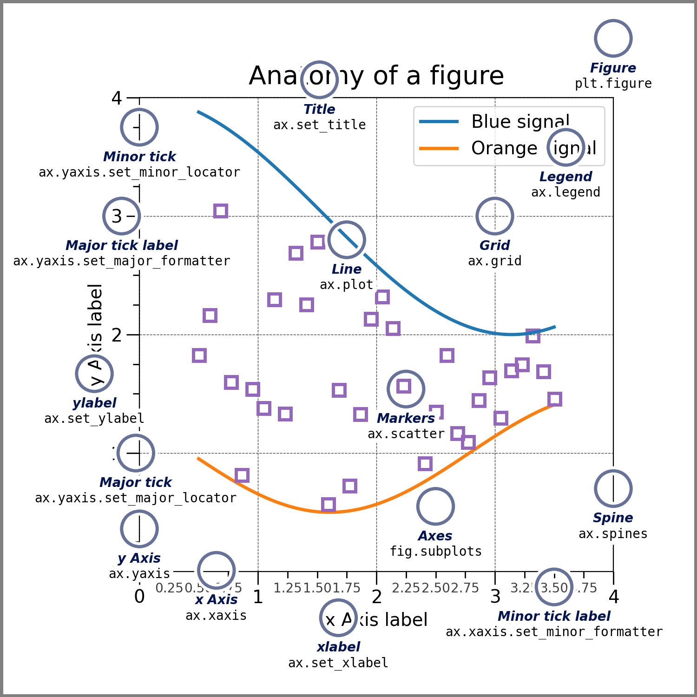

# Matplotlib
科学画图 与Numpy库强关联

## matplotlib.pyplot
类似MATLAB的绘图接口 每个pyplot函数会对图形做更改

这张图片反应了Matplotlib图表各个部件对应的方法


Matplotlib的基本对象是Figure(画布)和Axes(画布上的坐标系subplot)
### Figure
整个画布的对象的抽象 包含一个或多个Axes

创建画布
```python
fig = plt.figure(figsize=(6,4),dpi=100)
```

添加Axes
```python
ax = fig.add_subplot(1,1,1)
```

- figure(): 创建Figure对象
- add_subplot(nrows,ncols,index): 添加坐标系Axes
nrows代表子图行数 ncols代表子图列数 index代表这是第几个子图

### Axes
坐标系对象 多个的单个坐标轴Axis组成整个坐标系Axes

方法:
- `set_xlabel()/set_ylabel()`: 添加x和y轴的标题
- `set_title()`: 标题
- `legend()`: 图例
- `plot()`: 曲线/直线图
- `bar()`: 条形统计图
- `annotate("str",xy=(a,b),xytext=(c,d))`: 注释 比如箭头
xy是指向的点 xytext是指向点的文本
### Axis
单个坐标轴

### Artist
所有的对象都是Artist
## 示例
### 绘画各个激活函数和其导数
