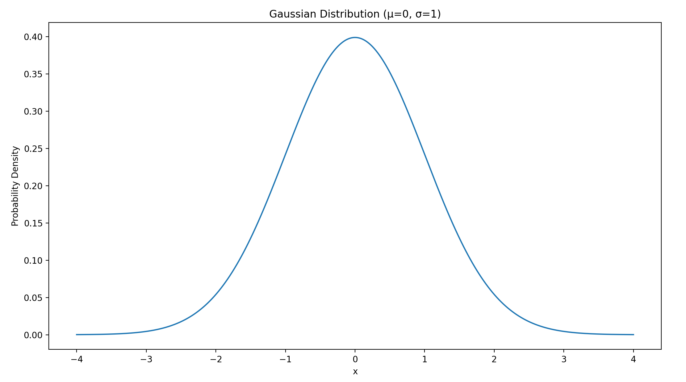

# 概率与统计
## 大数定律
样本数量越多 算数平均值有越高的概率接近期望

算数平均值:

$$
\tilde{X} = \frac{x_1 + x_2 + \cdots + x_n}{n}
$$

期望:

$$
E(X) = \mu
$$

则

$$
当n-> \infty, \tilde{X} -> \mu 
$$
## 中心极限定理

## 残差
- 真实值: $y_i$
- 预测值: $\hat{y_i}$

$$
\epsilon_i = y_i - \hat{y_i}
$$

## 一阶统计量
### 期望
期望表示了**随机变量可能取值的加权平均** 权重是相应取值的概率

离散的随机变量X:

$$
\mathbb{E}(X) = \sum_{i}x_i P(X=x_i)
$$

连续的随机变量X:

$$
\mathbb{E}(x) = \int_{-\infty}^{\infty}xPDF(x)dx
$$

### 方差
方差度量了随机变量取值的**离散程度** 表示**数据围绕期望的波动性**

$$
Var(X) = \mathbb{E}[(X - \mathbb{E}(X))^2] = \mathbb{E}(X^2) - [\mathbb{E}(X)]^2
$$

离散型随机变量X:

$$
\sum_i(x_i - E(X))^2 P(X=x_i)
$$

连续型随机变量X:

$$
\int_{-\infty}^{\infty}(x - \mathbb{E}(X))^2 PDF(x)dx
$$
### 标准差
标准差是方差的**平方根**

$$
SD(X) = \sqrt{Var(X)}
$$
## 二阶统计量
一阶统计量就是均值 

$$
\mu = E[x]
$$

二阶统计量描述均值之外的第二层结构

比如 方差 协方差 协方差矩阵
### 协方差
假设有两个随机变量X和Y 样本量为n 协方差定义为

$$
Cov(X,Y) = \frac{1}{n}\sum_{i=1}^{n}(X_i - \hat{X})(Y_i -\hat{Y})
$$

其中
- $\hat{X}; \hat{Y}$分别是X和Y的**均值**
- $(X_i - \hat{X})(Y_i - \hat{Y})$表示每个样本的**偏离量**

协方差衡量两个变量一起变化的趋势
### 协方差矩阵
当有多维数据$X \in \mathbb{R}^{n \times d}$时

X的每一列为一个特征

则协方差矩阵$C \in \mathbb{R}^{d \times d}$定义为

>注意 前提是X中心化了

$$
C = \frac{1}{n}X^T X
$$

在协方差矩阵中

- 对角线$C_{ii}$表示第i个特征的方差(自己和自己的协方差)
- 非对角线$C_{ij}$表示第i个特征和第j个特征的协方差

### PCC/Pearson
皮尔逊相关系数

PCC衡量两个变量之间**线性关系**的强度和方向

用于Lars回归等

$$
r_{xy} = \frac{Cov(X,Y)}{\sqrt{\sum_{i=1}^{n}(x_i - \hat{x})}}
$$
## 条件概率
在B事件发生的前提下 A事件发生的概率

$$
P(A \mid B) = \frac{P(A \cap B)}{P(B)}
$$

## 贝叶斯公式
在机器学习中的贝叶斯公式一般为

$$
P(C \mid X) = \frac{P(X \mid C)P(C)}{P(X)}
$$

其中
- $P(C \mid X)$: 给定输入X后 分类C发生的**后验概率**
- $P(X \mid C)$: 在分类C下 输入X的**似然**(概率密度)(也就是PDF的y轴)
- $P(C)$: 分类C的**先验概率**(训练数据集中该类别的出现频率)
- $P(X)$: 输入X的总概率
### 似然
假设参数是w 这些数据有多合理

- 概率是 参数已知 问数据出现的可能性
- 似然是 数据已知 把它当作参数的函数

>似然就是PDF曲线中的y值 而概率是PDF曲线的面积
>注意这个不等于概率 似然不是概率分布 因为积分不一定为1

\mathcal{L}(\theta|y)

## MAP
最大后验估计

在已经看到数据的前提下 选择后验概率最大的参数

$$
\hat{w}_{MAP} = \arg\max_{w} P(w \mid y)
$$

因为P(y)与w无关: P(y)是把所有可能的w都积分的常数

所以MAP等效为

$$
\hat{w}_{MAP} = \arg\max_w P(y \mid w)P(w)
$$

## PDF
概率密度函数

概率密度函数是 **描述连续型随机变量X取值分布** 的函数

对于任意的PDF函数有:
- $PDF(x) \geq 0$: 所有的概率>=0
- $\int_{- \infty}^{\infty}PDF(x)dx = 1$: 所有的概率加起来=1
- $P(a \leq X \leq b) = \int_{a}^{b}PDF(x)dx$: PDF底下的面积代表区间概率

> PDF(x)也就是y值不直接表示概率
> 对于连续变量 单个点的概率严格为0(勒贝格测度)
### 高斯分布/正态分布
随机变量X服从正态分布表示为

$$
X \sim N(\mu,\sigma^2)
$$

PDF:

$$
p(x) = \frac{1}{\sqrt{2 \pi \sigma^2} e^{-\frac{(x-\mu)^2}{2\sigma^2}}}
$$

其中
- 最大值在$x=\mu$时
- 均值=众数=中位数
### 拉普拉斯分布
随机变量X服从拉普拉斯分布表示为

拉普拉斯先验的信念是 在深度学习中 参数本身是稀疏的

$$
X \sim Laplace(\mu,b)
$$

PDF:

$$
p(x \mid \mu,b) = \frac{1}{2b} e^{(- \frac{|x - \mu|}{b})}
$$

其中
- $\mu$: 位置参数(中心)
- $b$: 尺度参数
- 均值$\mu$ 方差$2b^2$ 中位数$\mu$ 中枢$\mu$

## PMF
概率
